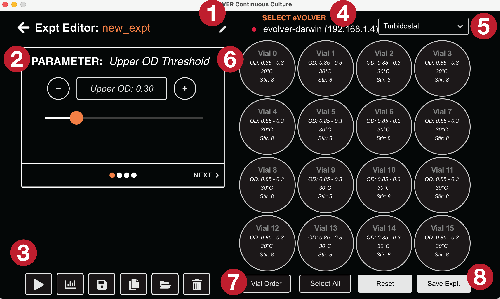

# GUI Start Guide

_You should be able to follow the 2019 JoVE_ [_paper_](https://www.jove.com/t/59652/designing-automated-high-throughput-continuous-cell-growth) _for most of the process. Differences will be highlighted here._

#### Running experiments with Dropbox/Google Drive

If you would like your data to be automatically backed up on Dropbox or Google Drive, first install the desktop applications. This will enable any computer with Dropbox/Google Drive and access to the directory to monitor the experiment using the eVOLVER GUI in real-time, while providing all the benefits of using these services (automatic backup of data, ease of data sharing, etc).

We recommend saving your experiments through Dropbox or Google Drive, but you do not have to - it's fine to have everything run locally on your lab computer. Both options will be detailed in the [Experiment Manager](gui-start-guide.md#experiment-manager) section below.

### Setup

Select the eVOLVER you wish to run an experiment on in the dropdown on the top right, then click the `SETUP` button.

On left side of the screen, ensure the correct calibrations are selected for Temp, OD, and the pumps. Click the box to bring up a list of available calibrations for each parameter.

Once you have selected the calibrations, you can set the initial stir and temperatures, and sterilize the fluidics as described in the JoVE paper.&#x20;

### Experiment Manager

The JoVE paper is out of date with regards to using the GUI for running and managing an experiment, from 3) Configuring eVOLVER Software and Programming Algorithmic Culture Routines on.

Open the experiment manager on the Home screen of the GUI. You should see something that looks like this if this is the first time you have used the application:

In the top center the `Expt Directory` is listed out. You can click the pen icon to change this location to be anywhere you like.

If you have Dropbox or Google Drive installed, you can select a location on the cloud to save your experiments. This will enable you to view your data from any computer that has permissions and the Dropbox/Google Drive application installed!

You do not need to make a new folder called `experiments` as shown below - the GUI will automatically create this directory.


If you'd like your data to be backed up on Dropbox or Google Drive, set this location BEFORE starting the experiment. Otherwise you will have to manually move it later to view the data in the GUI remotely. You can always click the Default Expt Dir button to reset the location back, or set your own personal location.


Click the `New Experiment` button to open a prompt to name your experiment. Type a name then click Submit.

Click the Pen button on the row of the new experiment to bring up with experiment editor page.

### Experiment Editor

By default, the Turbidostat editor will appear when you come to the editor page.&#x20;

1. The name of the experiment. You can click the pen icon to change the experiment name.
2. The parameter selector. The name of the currently selected parameter is listed at the top. You can click the -/+ buttons to change the value (or use the slider), and then click the box in the middle to apply this value to the selected vials.
3. Experiment control panel. From left to right: Start/Stop experiment, View Data, Save Files (Only for File Editor), Copy Experiment, View Files in File browser, Delete experiment.
4. eVOLVER Selector. Select the eVOLVER to run the experiment on.
5. Experiment type. Default will bring up the Turbidostat editor. Chemostat and growth rate editors are also available. You can also bring up the file editor to directly modify the python files within the GUI.
6. Vial selector - select the vials and then apply desired experimental parameters from the buttons on the parameter selector. Values display the currently set parameters.
7. Vial selector control buttons - flip the orientation on the display or select all of the vials.
8. Reset - goes back to default. Save Experiment - saves the parameters for all vials.


You MUST click Save Expt. to apply all the changes you made to the experiment!


The chemostat and growth rate modules function similarly to the turbidostat one.

Clicking File Editor in the experiment type dropdown will allow you to directly modify the python files.


Do not change the `EXP_NAME` variable if you wish to use the GUI based graphing features! We keep this variable here for backwards compatibility with the previous graphing app. They will be normalized in a future version.


You can select the file you would like to edit on the left, edit it on the right, and save by clicking the Save icon on the bottom left. For most cases you will not need to use this! If you change the files, you will not be able to use the t-stat/c-stat/growth rate modules, and you will need to modify the `EVOLVER_IP`, `OPERATION_MODE`, and other variables throughout the code.

You can also click the folder icon on the bottom left to view the files in a file browser and edit them using an editor of your choice.

### Starting the experiment

When you're ready to start the experiment, click the Play button either on the Experiment Manager page or the Experiment Editor page. Then you can click the graphs icon to go watch your experiment running in real-time.


If GUI graphing is not working, use [this](https://github.com/FYNCH-BIO/dpu/tree/master/graphing) graphing tool.


When you navigate to the graphs page, the graphs will look fairly empty to start. After a minute or so, data will start to appear as it is collected. You can also click the `VIEW LOGS` button to see how the experiment is running.

.png>)

On the left, you can modify how the graphs are displayed by clicking the appropriate radio buttons. You can also look close up at an individual vial and use the data slider at the bottom of the graph to zoom in on an area of interest.

When you click `ALL` to go back to seeing all vials, the range set on a single vial will be applied to all vials. You can click the radio buttons to set it back to the latest data.

To end the experiment, click the `STOP` square button on the device running the experiment.


If you are looking at the data on a different device than the experiment is being run on, you cannot control the experiment through the app! Do not click the play button!

