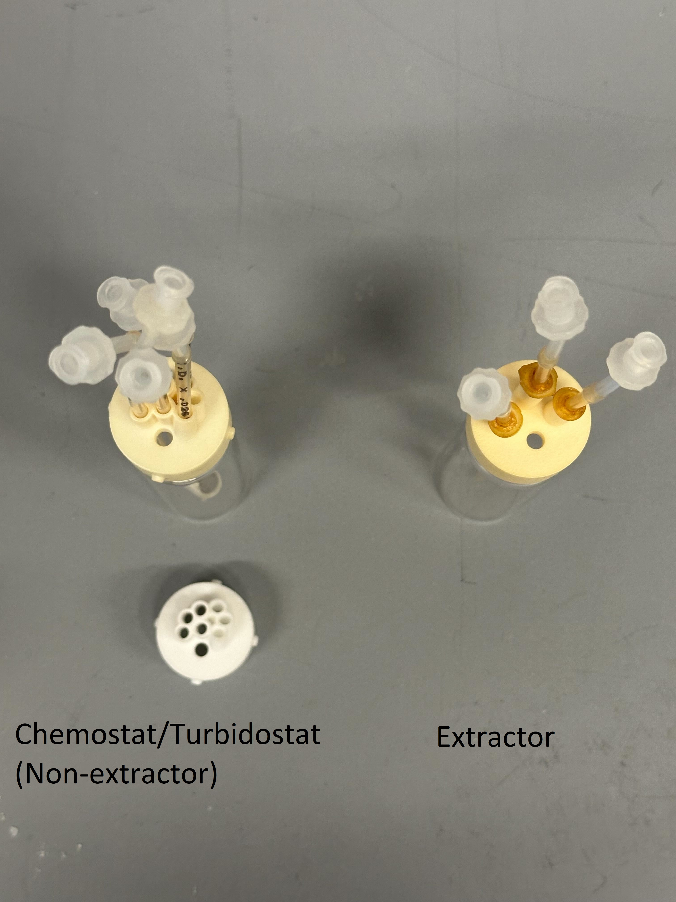
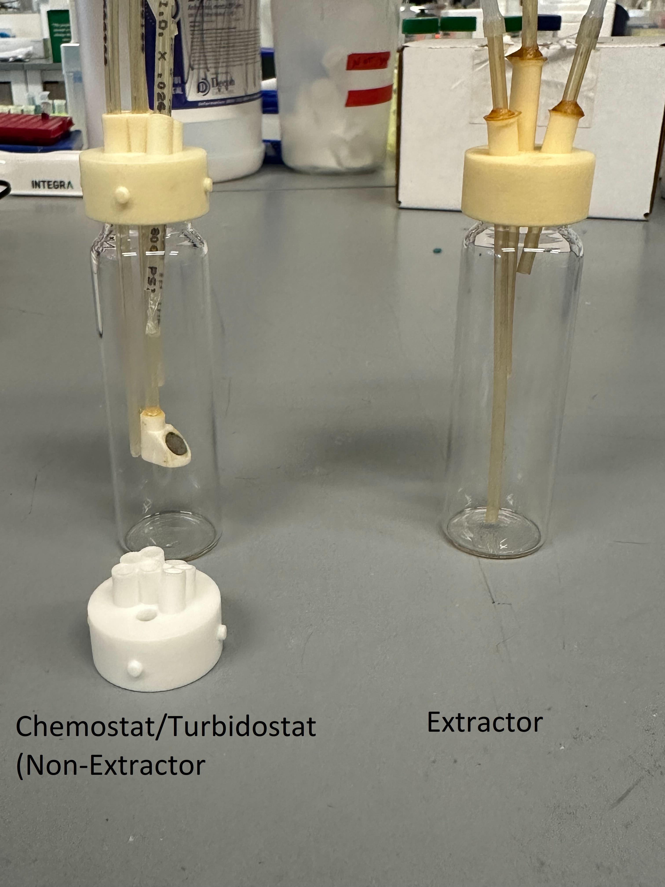
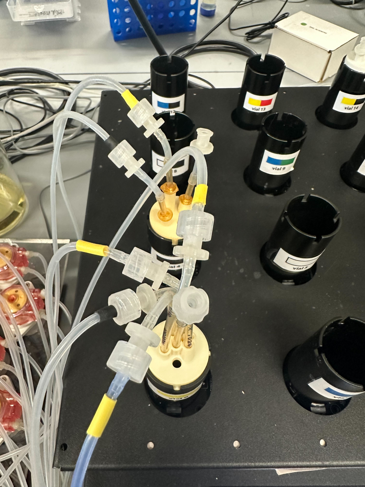
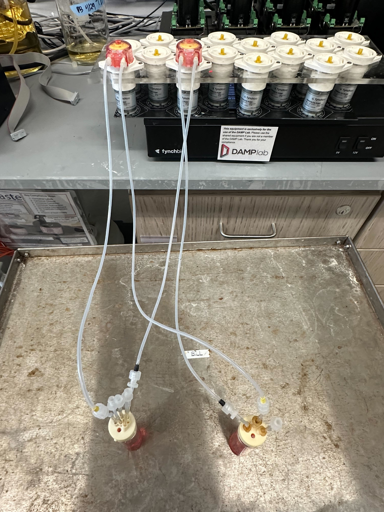
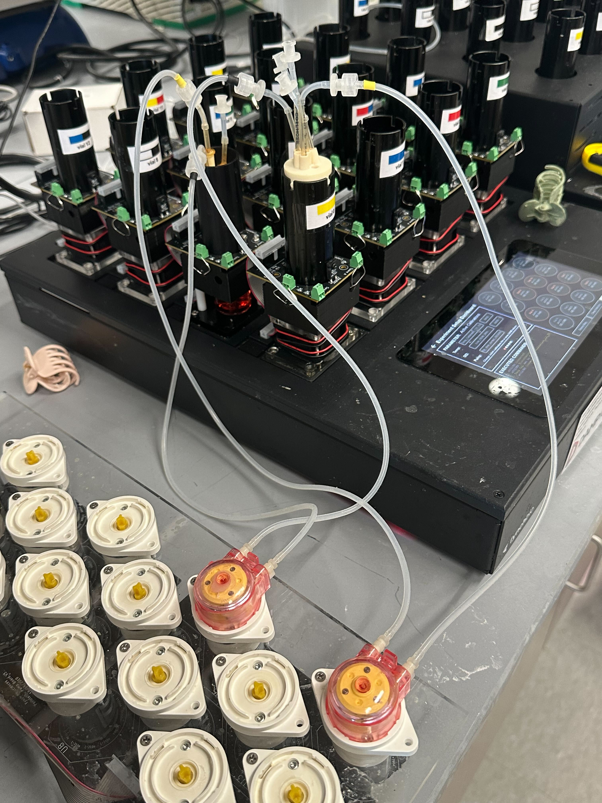
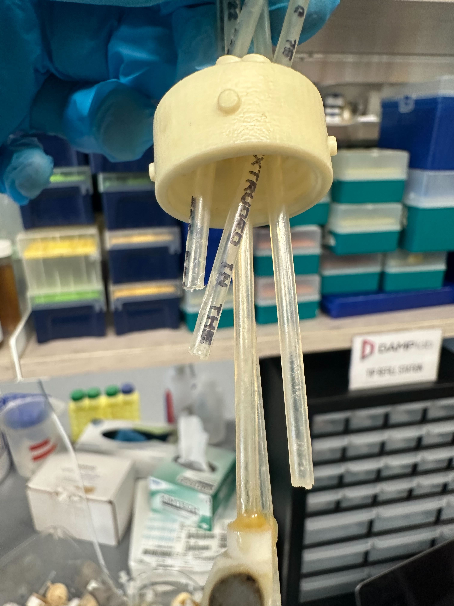
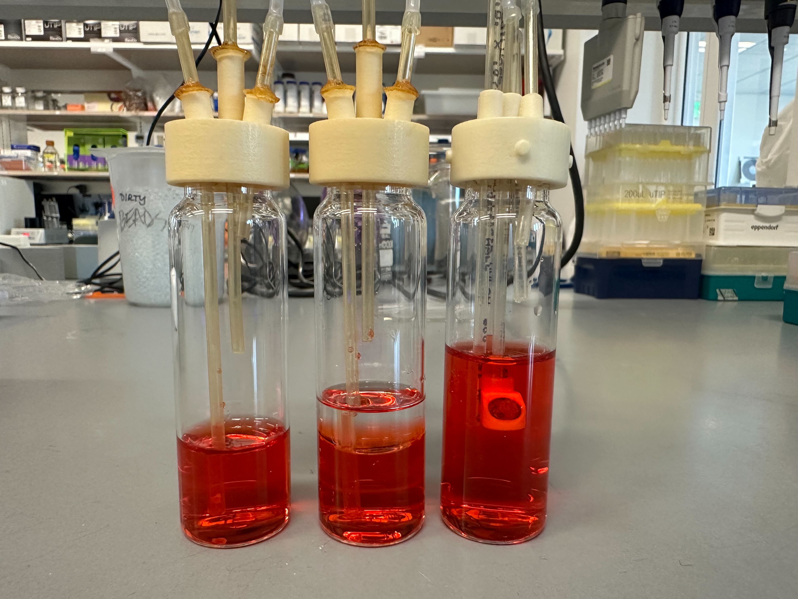
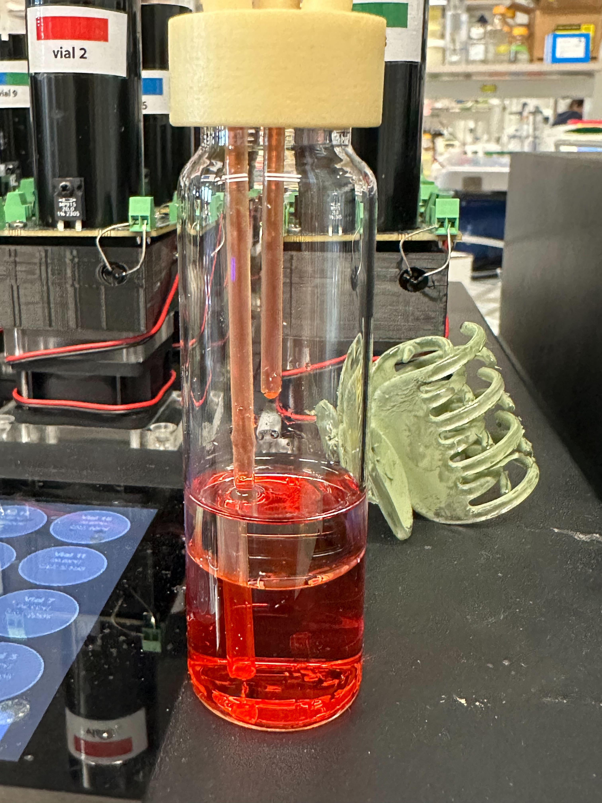
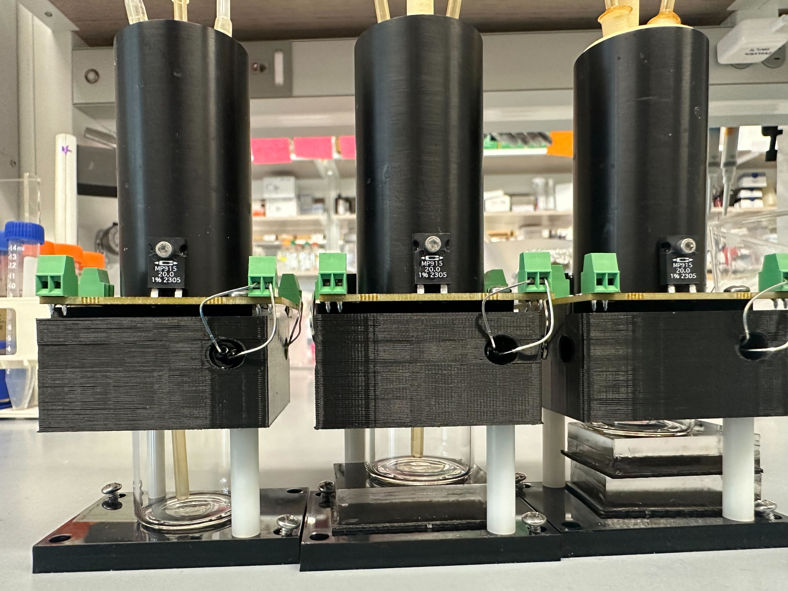
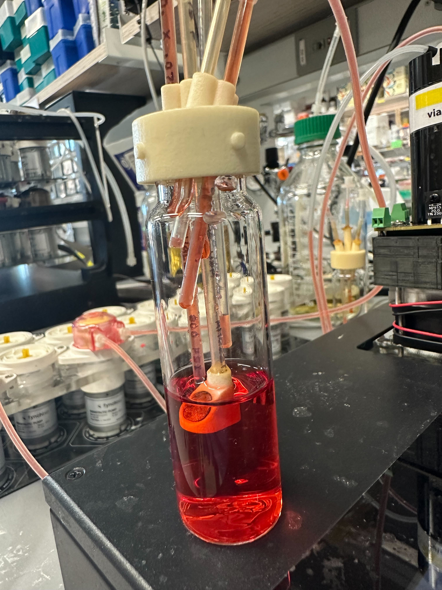

# Setting up your experiment

**1. Prepare and Organize Your Equipment**

* Gather all necessary vials, slow pumps, tubing, and any other required equipment.
  * Recommended equipment: clean vials, pumps, tubing, 1:1 extractor/non-extractor caps, appropriate media, clean beakers, 10% Bleach, 70% Ethanol
* Ensure that each extractor vial has a matching non-extractor vial (e.g., vial pair 0 and 4).

<figure><figcaption>
Vial Top View
</figcaption></figure>

<figure><figcaption>
Vial Side View
</figcaption></figure>

**2. Connect the Tubing**

* Match each pump with one extractor/non-extractor pair.
* For each pair, connect the tubing from the pump to the appropriate vials:
  * For example, if using vial pair 0 and 4, connect the pump to suck up liquid from vial 0 and dispense it into vial 4.

<figure><figcaption>
Diagram of extractor fluidics setup.
</figcaption></figure>

**3. Check Tubing Pathways**

* Carefully follow the path of the tubing:
  * Ensure the tube is correctly drawing from the extractor vial (e.g., vial 0) and dispensing into the non-extractor vial (e.g., vial 4).
  * Similarly, ensure the tube for the reverse flow (non-extractor to extractor) is correctly set up.

<figure><figcaption>
Close up view between Vial 0 (non-extractor) and Vial 4 (extractor)
</figcaption></figure>

While the tubing set up may look confusing at a glance remember that logically the setup works the same and as long as you understand the job of each pump on the slow pump array and the port to each straw on the cap you can trace back what goes where

<figure><figcaption>
Front View of just vials 0 (Left) and 4 (Right) outside of smart sleeve
</figcaption></figure>

<figure><figcaption>
Side view of just vials 0 and 4 on eVOLVER
</figcaption></figure>


When setting up the media influx as well as the vial-to-vial efflux in your Chemostat/Turbidostat vial ensure the media influx line is positioned **ABOVE** the vial-to-vial influx failure can result in contamination of media bottle.

The two angled straws positioned closer to the cap are your media influx and vial-to-vial efflux



**4. Volume and Media Preparation**

* Prepare 20 mL of media for the Chemostat/Turbidostat vials used in the experiment.
* For extractor columns, use a media volume of 15 mL to prevent the liquid level from reaching the photodiodes/LEDs.
* Use the pumps/slow pumps to fill lines with media
* Fill non-extractor lines and vials with media first and using a secondary set of extractor vials with media in them already [run the slow pumps](broken-reference) second to prevent bubbles from forming in slow pump lines
  * This is important because the initial blank should be based off of filled straws

<figure><figcaption>
Secondary Extractor Vial (Left) Experimental Extractor Vial (Middle) Non-Extractor Vial (Right)
</figcaption></figure>

<figure><figcaption>
Extractor Vial with straws properly filled (Ready for blank)
</figcaption></figure>

**5. Positioning of Vials**

* Ensure that the vials are placed correctly making sure you account for any added acrylic blocks underneath.
* Double-check that the liquid levels are BELOW the photodiodes/LEDs.

<figure><figcaption>
Acrylic blocks underneath can change the positional height of the vial
</figcaption></figure>

**6. Monitor the Pumping Process**

* Observe the pumping operation closely:
  * Ensure that the correct volumes are being transferred between vials as intended.
  * Monitor for any signs of malfunction or unexpected behavior.


Make sure to observe the straws carefully to ensure they are filled with media. Below is an example of a vial where some straws still have pockets of air.



**7. Ensure Cleanliness of Vials**

* Clean vials thoroughly to avoid stains, condensation, or drippage.
* Make sure there are no residual liquids that can impact the sensor readings.

**9. Adjust if Necessary**

* Make adjustments to tubing, pumps, or vial positions if liquid levels are incorrect or if the system does not operate as expected.

**9. Start the Experiment**

* Once all the checks and setups are completed, start the experiment with your [extractor script](broken-reference).
* Regularly monitor the system to ensure it is functioning correctly throughout the experiment.


The extractor will perform 2 blanks. One directly after starting the experiment and another 15 minutes into the experiment, the second blank can be changed in the [extractor script](broken-reference).


\
By following these steps, you can ensure a successful setup and operation of the two-column extractor system, minimizing errors and ensuring accurate experimental results.&#x20;
