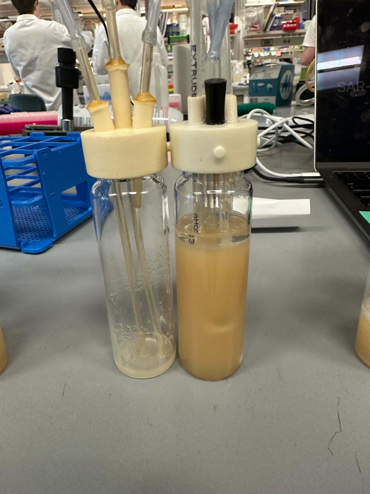

# Troubleshooting

The main result of issues with the extractor can lead to extractor or non-extractor vials to being empty or result in overflow.&#x20;

<figure><figcaption>
Pair of vials where extractor vial was all pumped out
</figcaption></figure>

Some factors that can contribute to this are:

**Condensation:**

Condensation can occur in the extractor vials depending on ambient conditions in the extractor as well as what organism you are working with. Condensation can obscure the photodiodes tricking them into thinking the vial has more volume then it actually does, triggering unwanted pump events. Generally the best solution for this is to ensure the heat is properly working or to raise the temperature of the vial.

**Disturbing the experiment:**

The extractor and non-extractor vials are delicate when the experiment is actively running. Vials should **NOT** be moved or sampled while the experiment is actively running. It is recommended to pause the experiment before handling any vials. Moving the extractor vials while the experiment is running can negatively impact the fluidics set up, or move the liquid into range of the photodiodes triggering an unwanted pump event.

**Contamination:**

Contamination of vials:

Vial contamination will cause a rapid increase in OD which will rapidly accelerate the rate at which pump events occur.

Contamination of media bottle:

If the non-extractor vial begins to overfill if it reaches the main media influx line the inoculated media can work its way back through the line towards your media bottle. Additionally the same can occur if you have your vial-to-vial line dispensing liquid from above your main media influx line which will again expose the main media line to inoculated media.

Improper [sterilization](broken-reference) of the fluidic lines can also cause contamination

**Incorrect Fluidics setup:**

Incorrect set up of the fluidics can cause immediate problems during your experiment make sure to double check your [setup](broken-reference) before starting your experiment

**Droplets on side of vial:**

In the extractor vials if the straw dripping culture in is placed too high above the liquid level the drops from the straw can splash and cause droplets to collect on the side of the vials. Causing a similar effect to condensation by obscuring the photodiodes triggering unwanted pump events. When designing your extractor caps measure the straw length so it sits at about 1 inch above your desired volume.

**Incorrect volume/block setup:**

Remember to double check what volume you are putting into the extractor vial, currently the volume of the extractor vials should be no greater than 15 mL the photodiodes should blank "nothing" at both blanking steps extractor vials exceeding 15 mL can interfere with the blanking steps causing immediate problems with pump events. Similarly if using acrylic blocks to elevate extractor vials remember to not account for how much "volume" each block take up.

**Dirty vials:**

Improperly cleaned vials can run into the same issues as condensation or droplets on the vial, again tricking the photodiodes into triggering an unwanted pump event.

