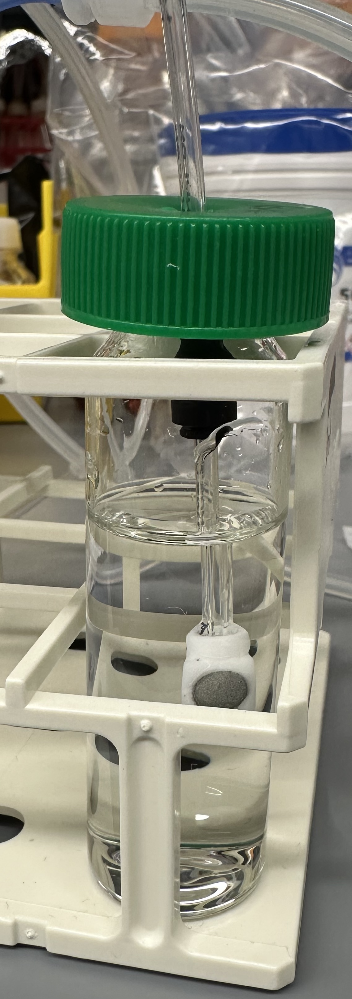

# Bubbler Cleaning / Testing Apparatus

## Overview

This apparatus is designed to save you time when you are cleaning bubblers.

.jpeg>)

## Construction

### Parts

#### Infrastructure (You may already have this in place)


We use the following, _however you are responsible for figuring out your plumbing before the 1/8" OD nylon tubing as you may have different air fittings in your building. You can likely ask facilities for help if this is overwhelming._


1. 1X - Gas regulator with pressure gauge capable of regulating to 10 psi
   1. For controlling air pressure to bubblers (we don't want 150 psi going through our bubblers!)
   2. 1X - [Pressure Gauge 1/4 NPT Male Bottom Connection, 2" Dial](https://www.mcmaster.com/4089K61-4089K12/)
   3. 1X - [Air Regulator 1/4 NPT Female, 1-5/8" Wide](https://www.mcmaster.com/6746K32-6746K18/)
   4. 1X - [Push-to-Connect Tube 1/8" Tube OD x 1/8 NPT Male](https://www.mcmaster.com/7880T113-52065K113/) - for going to nylon 1/8" tubing
2. 1X - Vacuum trap
   1. For example something like a [filter flask](https://ecatalog.corning.com/life-sciences/b2c/US/en/General-Labware/Flasks/Flasks,-Glass/PYREX%C2%AE-Heavy-Wall-Filtering-Flask,-Tubulation,-Graduated/p/5340-1L) before the vacuum line


Make sure to have a vacuum trap to prevent fluids from going into your vacuum line! You don't want facilities mad at you!


#### Cleaning Apparatus

1. [Teflon tape](https://www.mcmaster.com/6802K83/) - sealant for leaky threaded fittings (tightly wrap it around and break it off)
2. At least 6ft - [Nylon tubing](https://www.mcmaster.com/9685T1/) (1/8" OD)
3. 5X - [Push-to-Connect 1/8" Tube OD x 10-32 UNF Male](https://www.mcmaster.com/7880T111/)
4. 2X - [1:2 Splitter Push-to-Connect 1/8" Tube OD](https://www.mcmaster.com/5779K41/)
5. 1X - [Push-to-Connect Tube Fitting for Air **Straight** Connector, 1/8" Tube OD](https://www.mcmaster.com/5779K11/)
6. 3X - [Compact Push-Button, Normally Closed, 10-32 UNF Female](https://www.mcmaster.com/6790T41/)
7. [Flexible silicone rubber tubing](https://www.mcmaster.com/51135K14/) (3/32" ID (inner diameter))
   1. Alternatively you can try and jam some extra 1/16" efflux tubing onto the 1/8" nylon tubing
8. 50mL falcon tube cap (or an extra eVOLVER cap; see below for usage in push-to-connect cap)

### Assembly

.jpeg>)

#### 1. Assemble apparatus

1. Assemble the 3 push-button connectors using directions that come with them
2. Connect nylon tubing in the above configuration
3. Connect 3/32" tubing in the above configuration

#### 2. Assemble a vacuum trap to prevent liquids from entering building vacuum line

#### 3. \[Bubbler testing only] Assemble the push-to-connect cap

Used for easily attaching / detaching bubblers for testing

<figure><figcaption></figcaption></figure>

## Testing Protocol


Never allow water, bleach, or media into the apparatus as it will corrode the valves in the push-button connectors.


1. Attach the bubbler to the black 2-way connector connected to the green falcon tube lid as pictured below. To attach, push the bubbler in; to detach, push the black ledge into the connector and then pull the bubbler out.

<figure><figcaption></figcaption></figure>

2. Fill a vial with \~15mL of rich media like LB, YPD, or BHI. BG11 media will also work. As a rule of thumb, the less salt and peptides your media has dissolved in it, the larger your bubbles will be.
3. Place the green lid with the bubbler attached into the vial with media. Ensure the bubbler is submerged in the liquid.&#x20;

<figure><figcaption></figcaption></figure>

4. Ensure the air supply is turned on and set to 5-10psi. Check that the bubbler cleaning apparatus tubing is attached to the air supply. If air is flowing through the apparatus, you should feel a rush of air coming out of the red tubing.&#x20;
