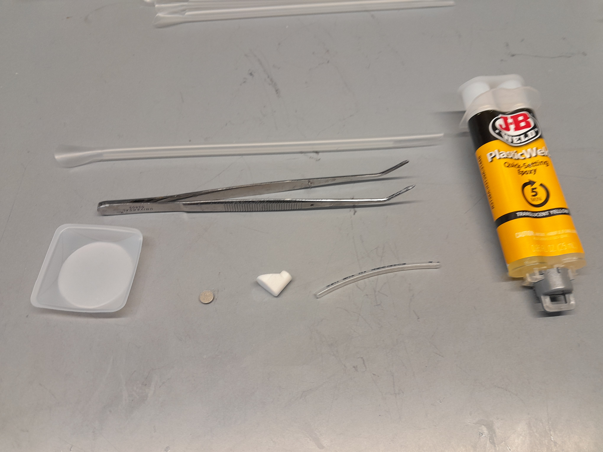

# Bubbler Construction Protocol

## Materials

* 3D printed (SLS, nylon PA-12) vial cap with ports for nylon tubing
* 3D printed (SLS, nylon PA-12) bubbler body
* [Plasticweld epoxy](https://www.mcmaster.com/7605A5/)
* [Nylon tubing](https://www.mcmaster.com/9685T1/) (1/8" OD)
* [Stainless steel frit ](https://www.mcmaster.com/9446T31/)- 5 micron filter, 1/4" Diameter, 1/16" Thick
* (Recommended) [Rubber stopper](https://www.mcmaster.com/9277K37/)
* (Recommended) [O ring](https://www.mcmaster.com/1171N163/)
* (Recommended) [Push to connect fittings ](https://www.mcmaster.com/5779K11/)for testing bubblers

## Construction Protocol

### 1. Cut Nylon Tubing to Height in Vial


The nylon tubing will straighten in the autoclave


The length of the tubing connecting the lid to the bubbler will be dependent on the culture volume of your experiments, which is determined by the length of your efflux straw. As a good starting point, a 2 inch efflux straw will correspond to a 20mL culture volume, and a 2.5 inch length of tubing connecting to the bubbler will be ideal for that volume. If your culture volume is different than this, the best way to find an ideal tubing length is by experiment:

1. Cut a length of nylon tubing and fit it in the cap and 3D printed bubbler holder. Make sure that you cut so that your bubbler is below your efflux straw!
2. HOWEVER, use caution with how low you set the bubbler; if the bottom of the bubbler body is below the 15mL line in the vial, it will begin to interfere with OD readings
3. Using the length of tubing you found as a template, cut equal lengths of tubing for the remainder of bubblers you will be making.
4. It's a good idea to make an excess of bubblers (25% or so) relative to the number of complete vial caps you'll be making, because the bubbler assembly process is tricky and you may have some that are not useable (see section 3)

### 2. Assemble Bubbler

#### Materials

<figure><figcaption>
Materials needed for bubbler assembly.
</figcaption></figure>

* Mixing tray (here a small weighboat)
* Disposable applicator
* Foreceps/tweezers
* Frit
* 3D printed frit holder
* Nylon tubing cut to length
* [Plasticweld epoxy](https://www.mcmaster.com/7605A5/)

#### Steps

1. Use gloves to avoid getting epoxy on your hands
2. Follow the epoxy directions to mix up a small amount of epoxy in a disposable dish or a piece of cardboard. Use even pressure to get even amounts of resin and hardener.
3. Use a pipette tip or other similarly sized applicator to put the minimum amount of epoxy around the rim of the 3D printed bubbler body where the frit will be placed
   * Avoid using too much epoxy around the rim, as that will tend to block air flow through the frit
   * Avoid using too little expoxy around the rim, or having uneven coverage, as that will lead to large bubbles escaping through the rim and defeating the bubbling action of the frit. It's a balance!
4. Using tweezers, carefully set the frit in place on the bubbler body - it should be a slight pressure fit.
   * Try to avoid getting epoxy anywhere outside of the rim of the frit as this will reduce air flow through the frit, and produce fewer bubbles.
   * Do your best to set the frit on the bubbler body as parallel as possible to the frit holder rim. If you place it at an angle, it will likely be very hard to press in. If this happens, your best bet is to  take the frit off with tweezers and try setting it in place again.
5. Add epoxy to one of the ends of the previously cut nylon tube. Get the epoxy around the outside of the last 1/4-1/2" of the tube, with roughly even coverage. If you get epoxy inside the tube, you can blow it out or use a paperclip or similar object to clear it.
6. Set that end of the tube into the bubbler body, and give it a twist to ensure the epoxy is spread evenly at the joint. Don't force the tube all the way down into the bubbler body, there should be a lip that catches the tube with slight pressure.
7. Set bubbler upright to cure overnight



### 3. Test Bubblers


To our best guess, the stainless steel bubbler frits need to be [passivated](https://en.wikipedia.org/wiki/Passivation\_\(chemistry\)), but they are incompletely passivated when they leave the factory. Without this step, they will produce larger (worse) bubbles, likely due to a more hydrophobic surface.


1. Passivate the frits by submerging in liquid
   1. Option 1: Soak in water overnight
   2. Option 2: Soak in LB-Miller media or 5% citric acid for 1 hour. Lemon juice will do in a pinch.
2. Create a test system for the bubblers
   1. You can attach the normal 1/16" ID eVOLVER tubing to the end of the nylon, but this may take more time per bubbler as the silicone tubing is hard to put on the nylon tubes
   2. Especially if you have a lot of bubblers to test, you may want to use a [push to connect fitting ](https://www.mcmaster.com/5779K11/)for easy swapping of bubblers
   3. Connect the bubblers to your air distributor (ie your 1:16 air supply)
3. Check that your bubblers work well in rich media like LB, YPD, or BHI. As a rule of thumb, the less salt and peptides your media has dissolved in it, the larger your bubbles will be.
4. If one of your bubblers are not bubbling at all, check your tubing connections and try to run air through just that bubbler. If it's still not producing bubbles at 5psi of back pressure, it's likely blocked with epoxy, and is not useable.
5. If one of your bubblers is producing a steady stream of large bubbles from the rim of the frit, it means there's an incomplete epoxy seal against the bubbler body. You can attempt to fix this by adding more epoxy on the outside, but it'll likely be easier to just make a new bubbler.


Four bubblers working well. Note the small bubbles.


### 4. Epoxy Bubbler into eVOLVER Cap

1. Similar to the assembly of the nylon tube into the bubbler body, apply expoy to the other end of the tube attached to your bubbler, insert into one of the ports on the bottom of the vial cap (whatever one corresponds to your preferred layout; my preference is for media in on the right, bubbler in the back, efflux straw on the left).
2. Again, be sure to check for epoxy blocking the tubing, and clear with a paperclip if it's blocked.
3. Set assembled caps upright (with a vial rack or spare vials) so that epoxy doesn't drip into the o-ring groove as it cures.
4. Allow epoxy to cure 24 hours before sterilizing via autoclave as part of experiment prep.&#x20;
