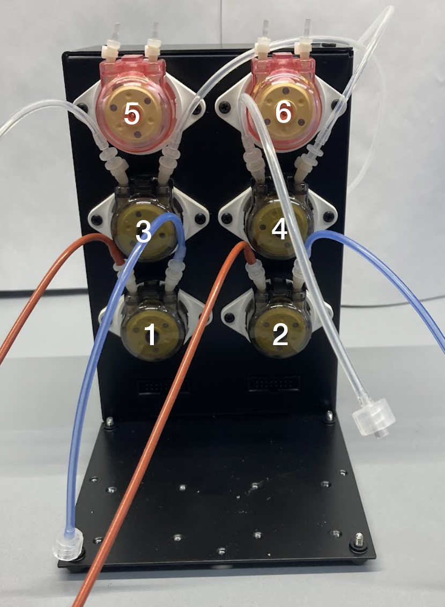

# Setup

## Software Installation

1. Download files from GitHub repositories for the [dpu](https://github.com/FYNCH-BIO/dpu/tree/min) (experiment code) and [server](https://github.com/FYNCH-BIO/evolver/tree/min) (communicator with min-eVOLVER)&#x20;

<figure><figcaption>
Make sure you are on the 'min' branch (upper left) and click the code button to download the .zip file for the code
</figcaption></figure>

2. Follow the dpu installation [guide](../../getting-started/software-installation/dpu-installation.md).
3. We will use the virtual environment made here to run the experiment
4. Note: as of now, there is no GUI integration. Command line only.
5. Create a server virtual environment
   1. In the command line still, open a new tab or window&#x20;
   2. If necessary, deactivate the dpu virtual environment with the command below.
      1. `deactivate`
   3. Navigate to the server directory `evolver-min`
   4. Follow the dpu installation guide from step 7 to make a server virtual environment
   5. Replace instances of `dpu` in commands with `server`


If you are setting up more than one min-eVOLVER, simply make an additional folder and label it something like `evolver-min2`. No need to make an additional virtual environment.


## Server Startup

1. Plug the min-eVOLVER in to your computer using micro-USB and THEN plug it in to the 12V DC power supply.


Plugging in the 12V first may make the server not able to connect properly.



Whenever possible, avoid plugging / unplugging the min-eVOLVER micro-USB, which is fragile. Instead, leave the micro-USB plugged in and plug / unplug the regular USB to your computer.


2. Make sure that you are in the server virtual environment
3. This means navigating to the correct folder in a terminal of your choice and inputting commands:
   1.  Mac OS:

       `source server-env/bin/activate`
   2.  On Windows PowerShell:

       `server-env\Scripts\Activate.ps1`
4. Navigate to the `/evolver/` folder inside the evolver-min server code
5. Attempt to run the server
   1. `python3 evolver.py`
   2. Exit from the command using `control + C`
6. This will tell you the list of min-eVOLVERs plugged in to the computer
7. Copy the full port address into the `serial_port` variable in the `conf.yml` file for the server
   1. On Mac OS for example: `serial_port: /dev/cu.usbmodem1301`


Be careful to not alter the `conf.yml` file structure, only the variables (after the ":"). Changing the file structure in the wrong way will result in the server failing to run.


7. Start the server using `python3 evolver.py`
8. Observe the server for expected behavior
   1. The server cycles once every 20 seconds
   2. If the server is not connected to the min-eVOLVER, commands will fail

<figure><figcaption>
An example min-eVOLVER server readout.
</figcaption></figure>


If you want to know more about the server code or how commands work click [here](../../software/server-code-structure/).


## Test min-eV Hardware


Do NOT plug the pumps in to the right two ribbon cable ports (reserved for the vials). The pumps will draw too much current and likely break components inside of the min-eVOLVER board.


1. Plug in the hardware as shown above
2. Start the server
3. In another terminal window, enter the `dpu` virtual environment
4. Navigate to the `/dpu/experiment/` folder
5. Familiarize yourself with [send\_command.py](send\_command.py.md) and make sure you can:
   1. Send a pump command to all pumps and make sure they actuate
   2. Send a command to start and stop stirring
   3. Turn temperature off
6. Check the server log as commands go in, these should be received and become the new values in the server cycle

## Multiple min-eVOLVERs

You can connect multiple min-eVOLVERs to one computer, as long as you have enough USB ports!

1. Make a duplicate min-eVOLVER server code file with a new number ie `evolver2`
2. Plug in the new min-eVOLVER and follow the Server Startup guide
   1. The new min-eVOLVER will have a different `serial_port`
   2. You need to define a different port number (try 5556) in both the `conf.yml` file and the `custom_script.py` (see [here](starting-an-experiment.md#software))
3. Make sure you're in the right server code folder when starting the new server
   1. Use a different command line window for each min-eVOLVER server


Make sure you don't swap your min-eVOLVERs USB ports without meaning to!

* Calibration files are for a specific min-eVOLVER
* `serial_port` numbers on your computer are linked to a specific _USB port_, NOT to a specific min-eVOLVER
* So for example:
  * min-eVOLVER 1 with `serial_port: /dev/cu.usbmodem1201`&#x20;
  * min-eVOLVER 2 with `serial_port: /dev/cu.usbmodem1301`
  * Plugging min-eVOLVER 2 into `/dev/cu.usbmodem1201` will mean that running the min-eVOLVER 1 server will load calibrations for the wrong min-eVOLVER and vice versa

