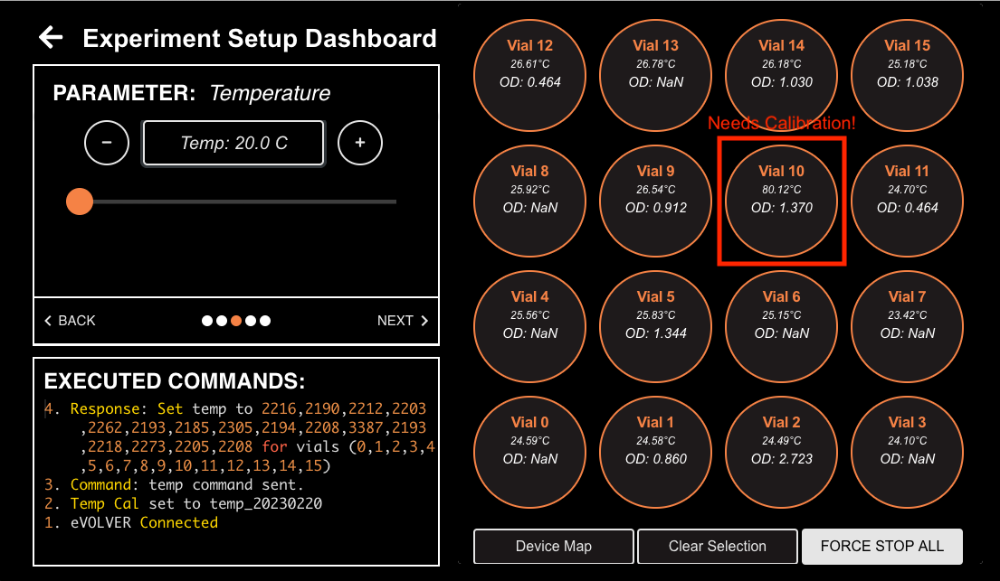
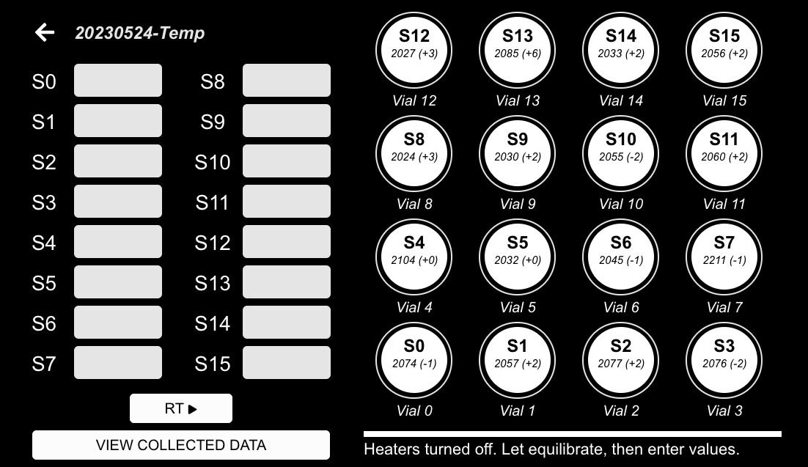
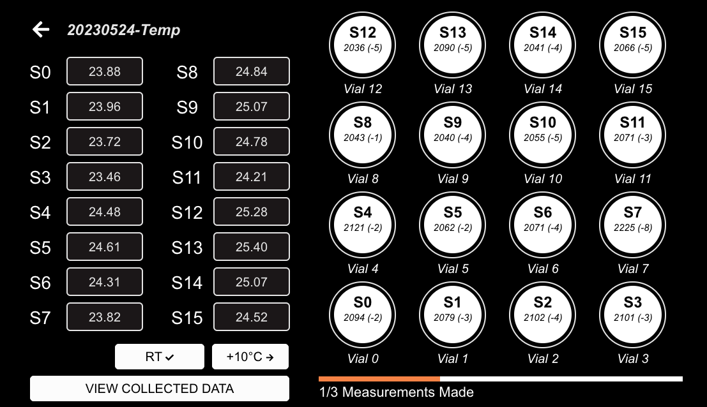
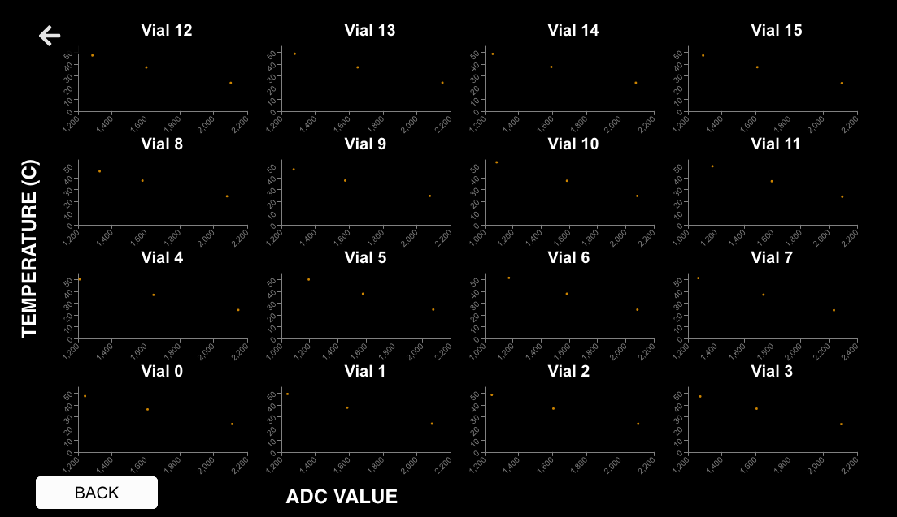
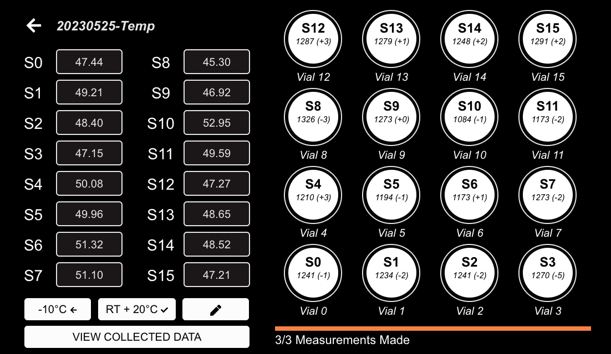
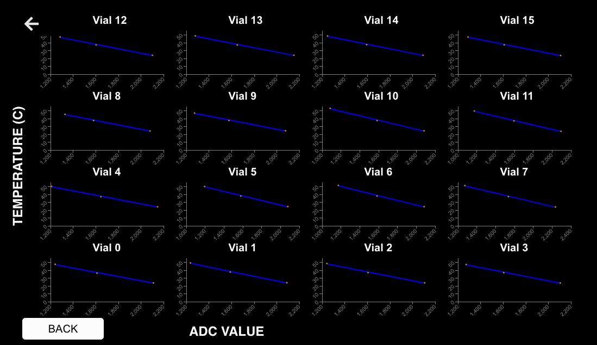

# Temperature Calibration


You must complete temperature calibrations before doing OD calibrations. Temperature affects OD and if there are big differences between vials, you will need to recalibrate all vials once you do a temperature calibration.


## About

**Why are temperature calibrations important?**

Each microorganism has its own culture temperature requirement. Temperature may affect the successful cultivation and growth characteristics of the culture. By using a simple thermistor and heating resistor pair, we can track and change the culture temperature over time.

**Why is calibration necessary?**

Readings sent from the Raspberry Pi to the computer/server are the raw thermistor values measured by the Arduino. To make sense of the readings in terms of values we understand, we need a calibration file that converts this to degrees (celsius).

**Do I need to redo temperature calibration if I switch out a thermistor/resistor pair?**

Yes. Variability exists across the individual thermistor and heating resistor elements, necessitating a new temperature calibration anytime one of these parts are replaced. This is why the calibration curve is unique to each smart sleeve.

## Materials

* 16 eVOLVER vials filled with 15mL water
  * Glass vials - 40mL  ([Chemglass, CG-4902-08](https://chemglass.com/sample-vials-only-clear-type-1-borosilicate-glass))
* Thermometer with probes
  * Do not use a thermocouple-based thermometer, as the magnetic field from the stir components can interfere with measurements
  * _We use the "_[Fisherbrand™ Traceable™ Excursion-Trac™ Datalogging Thermometers](https://www.fishersci.com/shop/products/fisher-scientific-traceable-excursion-trac-datalogging-thermometers-7/15081124)"
* eVOLVER Electron GUI
  * This tutorial is for the newest version of the eVOLVER Electron App (Release 2.0.1), which enables both data visualization between each temperature calibration step (RT -> +10C -> +20C), as well as GUI-enabled calibration (without use of the command line).
  * For older versions of the Electron GUI (Release v1.2.1 and earlier), additional notes are provided at the bottom to successfully complete the calibration - the process remains largely the same, apart from the use of the command line to complete the calibration.
* eVOLVER

## Methods


**Temperature Equilibrium**

Generally, there are two independent methods to determine if the vial water has reached temperature equilibrium.

1. Place the thermometer probes into the water, clear the "Min/Max" readings, and wait until the reads no longer fluctuates within \~2min of monitoring.
2. The eVOLVER Electron GUI has an in-built function that displays the change in thermistor value from the last read, shown as a (+/-) value in brackets next to the current thermistor value being read. The GUI uses this information to determine whether the vials have equilibrated across time, shown as an orange circle indicator around each vial circle on the GUI that should turn fully orange upon equilibration.
   * **Importantly**, sometimes the vials will not display the achievement of equilibrium correctly. Please use your discretion with respect to the time elapsed under heat, lack of temperature fluctuations, similarity of temperature measured by thermometer across vials, and the GUI equilibrium function to determine when equilibrium has been reached.


* Turn on the eVOLVER 5V power supply. Wait 5 seconds. Turn on the eVOLVER 12V power supply.
* Open up the eVOLVER Electron GUI app, and ensure you are connected to the correct eVOLVER you wish to calibrate in the upper-right hand corner of the "Home Screen". The circle should be solid green, indicating that the eVOLVER is connected.
* Tap "Setup" in the GUI home screen, select all vials by tapping "Select All" in the bottom right corner. The vial circles should highlight orange. Tap the "Next ->" button in the upper right-hand box (which includes all the control parameters) until you reach the "Temperature" tab. Drag the slider all the way down to "20C". Tap the button, and the "Executed Commands" box in the lower right should indicate that a temp command was sent to all vials.

<figure><figcaption></figcaption></figure>

* Place all the eVOLVER vials, pre-filled with 15mL of water, into the Smart Sleeves.
* Go back to the "Home Screen", click "Calibrations" and then "Temp" in the eVOLVER Electron App.
* Name the calibration, hit enter, and then click "Start Temperature Calibration". A prompt will read "Heaters turned off. Let equilibrate, then enter values."

<figure><figcaption></figcaption></figure>

* **Room Temperature:** Wait \~30 minutes for the temperature of the water to equilibrate to ambient room temperature (and heat generated by the eVOLVER).
* Once equilibrated, measure the temperature of each vial with the thermometer probe and log the temperature measurements in Celsius in the Electron GUI.
* Press the "RT :arrow\_forward:" button and wait for the eVOLVER to measure the thermistor values (the eVOLVER measures the thermistor values continuously for a minute, with an orange ring appearing around the :arrow\_forward: button. Once complete, the GUI should display "1/3 Measurements made"

<figure><figcaption></figcaption></figure>


The newest version of the eVOLVER Electron App (Release 2.0.1) enables data visualization between each temperature calibration step (RT -> +10C -> +20C). This is especially useful when verifying that the thermistor reads are as expected, and follows an inverse linear relationship between thermistor value and temperature.


<div data-full-width="false">

<figure><figcaption><p>Real-time temperature calibration data visualization on the eVOLVER GUI interface</p></figcaption></figure>

</div>

* **Room Temperature +10C:** Once complete, click the " +10C ->" button, and then click the "RT +10C :arrow\_forward:". The GUI should display "Temperature set. Let equilibrate, then enter values."
* Wait 60-120 minutes for the temperature of the water to equilibrate. Use the system outlined in the section "**Temperature Equilibrium"** to establish when the temperature has equilibrated.
* Once equilibrated, measure the temperature of each vial with the thermometer probe and log the temperature measurements in Celsius in the Electron GUI. Press the "RT +10C :arrow\_forward:" button and wait for the eVOLVER to measure the thermistor values. Once complete, the GUI should display "2/3 measurements made"
* **Room Temperature +20C:** Once complete, click the " +20C ->" button, and then click the "RT +20C :arrow\_forward:". The GUI should display "Temperature set. Let equilibrate, then enter values."
* Wait \~2-3hrs, or leave overnight.
* Once equilibrated, measure the temperature of each vial with the thermometer probe and log the temperature measurements in Celsius in the Electron GUI. Press the "RT +20C :arrow\_forward:" button and wait for the eVOLVER to measure the thermistor values. Once complete, the GUI should display "3/3 measurements made"

<figure><figcaption></figcaption></figure>

* **Calibrate:** An edit icon button should appear once all 3 measurements have been made. Click on the button, and a graph of the linear calibration curves for all thermistors across the smart sleeves should appear. Please confirm that the curves look linear. If everything looks good, please exit out of the graph (press the backwards arrow twice), and voila! You have completed your Temperature Calibration! Please be sure to change the temperature calibration file to the most recent in the eVOLVER set-up menu (click on the temperature calibration button).

<figure><figcaption><p>Example image of a successful temperature calibration</p></figcaption></figure>


**IF In-GUI Calibration Fails (Unexpected Javascript/Python Error)**

If after clicking on the "Edit" button upon completion of all 3 measurements, the eVOLVER GUI encounters an unexpected Javascript/Python error, **do not fret!** The raw calibration data is now saved on the Raspberry Pi, so you just need to continue along to the info note below to run the calibration through the command line. Feel free to exit the calibration at this point - your collected data is safe.



**For older versions of the eVOLVER electron GUI (Release v1.2.1 and earlier)**

If you are using an older version of the eVOLVER electron GUI (< v2.0.0), an additional step on the command line/terminal is required to linearly fit the acquired calibration data and set-up the temperature calibration. Additionally, there have been instances where unexpected code errors arise, necessitating calibration through command line. You can also still manually run a calibration if you would like to change calibration settings.

Open up a terminal, and navigate to the eVOLVER dpu folder ([github link](https://github.com/FYNCH-BIO/dpu) for download). List the raw calibration files on the eVOLVER Pi using:

```
python calibration/calibrate.py -a <ip_address> -g
```

For Windows, use py instead of python for all commands.

Now that you have the name of the temperature calibration file, manually run the calibration file:

```
python calibration/calibrate.py -a <ip_address> -n <file_name> -t linear -f <name_after_fit> -p temp
```

A figure will pop up displaying the linear temperature calibration curves for each vial. If all looks good (inverse linear relationship between thermistor and temperature values - please see above figure for an example of a successful temperature calibration), then exit out of the figure. A prompt on the command line will ask if you would like to update the eVOLVER to the new temperature calibration. Press and enter "y", and voila, you are all done with temperature calibration.




