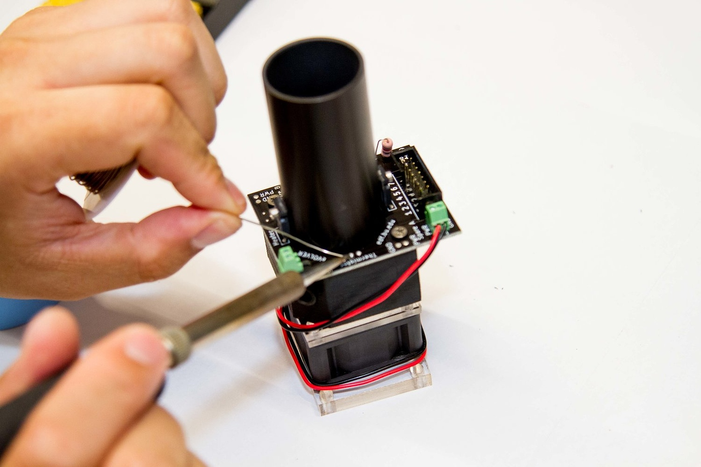

# Building a Smart Sleeve

1. [Background](building-a-smart-sleeve-1.md#background)
2. [Guide](building-a-smart-sleeve-1.md#guide)

If you need additional aid or have questions about this process, feel free to ask on the [forum](https://www.evolver.bio/t/building-a-smart-sleeve-for-continuous-culture-40-ml/30)!

## Background

eVOLVER hardware is primarily divided between the Smart Sleeves and Motherboard. The Motherboard is where all the sensitive control hardware is, whereas the Smart Sleeve is nice modular way of integrating all the sensors to control your culture conditions.

#### Goal

The goal of this tutorial is to show how one can build an eVOLVER Smart Sleeve using commonly found tools and easily customizable parts.

#### Time/Cost

We are describing the Smart Sleeve built for continuous culture documented in our [**Nature Biotechnology paper**](https://www.nature.com/articles/nbt.4151). It typically takes 10 to 15 minutes for construction of this version of the Smart Sleeve with all the appropriate parts (e.g. soldered PCB, constructed aluminum tube). Raw materials cost roughly $40/ vial however cost for 3D printing, machining, and coloring (spray painting/ anodizing) parts vary due to accessibility to appropriate tools.

#### That all sounds great, **but I have never soldered or 3D printed before, how do I start?**

Here is a great introductory tutorial on soldering from our friends at [**Sparkfun**](https://learn.sparkfun.com/tutorials/how-to-solder-through-hole-soldering)**.** Also, you can easily outsource your 3D printed parts to be produced by folks at [**3DHubs**](https://www.3dhubs.com/) by uploading the appropriate [**STL file**](https://www.fynchbio.com/s/Tube-Holder.STL) (if you’re a student, don’t forget the student discount!). Generally, building a Smart Sleeve is simple because we only use through hole components and screw terminals, so it is much easier to make than surface mount designs.

**How can I modify or change the design?**

We built our PCB designs on [**KiCAD**](http://kicad-pcb.org/), an open-sourced software for circuit board design, and our 3D models on Solidworks. Here is a schematic of the PCB [**here**](https://www.fynchbio.com/s/Vial_Board_Schematic.pdf) and the Solidworks part [**here**](https://www.fynchbio.com/s/Tube-Holder.SLDPRT). There are many other programs for vial board design, including a bunch of tutorials on [Eagle from Sparkfun](https://learn.sparkfun.com/tutorials/using-eagle-schematic), another popular CAD tool for the open-source community.

#### **Does this tutorial include how to build the Motherboard?**

No. This tutorial only provides instructions on how to build a Smart Sleeve.

## Guide

**1. To assemble each Smart Sleeve, you will need all 16 components listed in Figure 1.**

<figure><figcaption>
Figure 1
</figcaption></figure>

List of supplies needed (**Figure 1**):

1. Aluminum Tube
2. Thermistor
3. 2x IR Photodiode
4. IR LED
5. 2x Stainless Steel Screws, 2.5" 4-40 threading
6. 2x Socket head screw
7. 1.5mm Flathead screwdriver
8. 1mm Phillips screwdriver
9. Laser cut 1/8" Acrylic Fan Spacer with circular cutout
10. Laser cut 1/8" Acrylic Fan Spacer
11. Laser Cut 1/4" Acrylic Base
12. 12 V DC Computer Fan with Magnets Glued
13. Vial Board
14. 3D Printed Part
15. Lab Tape **(Not Shown)**
16. Soldering Iron + Solder **(Not Shown)**

**2. Begin by assembling the aluminum tube and vial board. Align the holes as shown in Figure 2, then secure the two pieces together using the small black socket head screw (Figure 3). Repeat this process to align and secure the holes on the opposite side.**

<figure><figcaption>
Figure 2
</figcaption></figure> <figure><figcaption>
Figure 3
</figcaption></figure>

**3. The thermistor has one side covered in plastic (with writing) and one exposed side (Figure 4). Ensure the exposed side faces the aluminum tube. Thread the thermistor’s lead wires through the two vials on the PCB (Figure 5) and secure it in place using lab tape, as shown in Figures 6.1 and 6.2. Tape the thermistor parallel to the length of the tube, about 0.5 cm away from the bottom of the tube. The leads should be exposed when slotted into the 3D printed part.**

 <figure><figcaption>
Figure 5
</figcaption></figure>

<figure><figcaption>
Figure 6.1
</figcaption></figure> <figure><figcaption>
Figure 6.2
</figcaption></figure>

**4. Next, insert the black 3D-printed component beneath the PCB (Figure 7), positioning the indented section over the thermistor. Avoid damaging the thermistor by twisting or rotating the parts.** **Secure all components using two long silver socket head screws (Figure 8).**

 <figure><figcaption>
Figure 8
</figcaption></figure>

**5. To attach the 12V DC computer fan, use two laser-cut 1/8” acrylic fan spacers and a 1/4” acrylic base. First, attach the square fan spacer, followed by the spacer with the circular cutout (Figure 9.1). Orient the fan according to the directional arrows shown in Figure 9.2. Coil the fan wires tightly around the base of the Smart Sleeve and connect them to the screw terminal labeled “P2” (Figure 9.3), where the red wire should be connected to the ‘+’ vial and the black wire should be connected to the ‘-’ vial. Finally, attach the acrylic base to the bottom of the Smart Sleeve (Figure 9.4) and secure the assembly by tightening the two long silver socket head screws.**

<figure><figcaption>
Figure 9.1
</figcaption></figure> <figure><figcaption>
Figure 9.2
</figcaption></figure>

<figure><figcaption>
Figure 9.3
</figcaption></figure> <figure><figcaption>
Figure 9.4
</figcaption></figure>

**6. Both the IR LED sensor (clear) and the IR photodiode sensors (black) feature one long and one short lead (Figure 10). The long lead should be connected to the ‘+’ vial on the PCB, and the short lead to the ‘–’ vial (Figure 11.1).**

 <figure><figcaption>
Figure 11.1
</figcaption></figure>

**7. Connect the IR LED sensor (clear) to the IR LED screw terminal ports on the PCB, observing the correct polarity – long lead to the ‘+’ port and short lead to the ‘–’ port (Figure 11.2). Bend the sensor into the corresponding slot, which is an opening on the black 3D-printed part below the IR LED terminal (Figure 11.3), and separate the leads as shown in Figure 11.4.**

<figure><figcaption>
Figure 11.3
</figcaption></figure> <figure><figcaption>
Figure 11.4
</figcaption></figure>

**8. Repeat the same process for both IR photodiode sensors (black), connecting each to the appropriate screw terminal ports labeled with “Spare A” and “PD135” (Figures 12 and 13).**

 <figure><figcaption>
Figure 13
</figcaption></figure>

**9. Finally, solder the thermistor onto the PCB (Figure 14).**

**That’s it! You’re done.**

Following a similar framework for building the Smart Sleeves enables adding different parameters, adaptation to different vial sizes, and other creative eVOLVER applications! Have fun! Let me know if anything is unclear on the [forum](https://www.evolver.bio/t/building-a-smart-sleeve-for-continuous-culture-40-ml/30).
