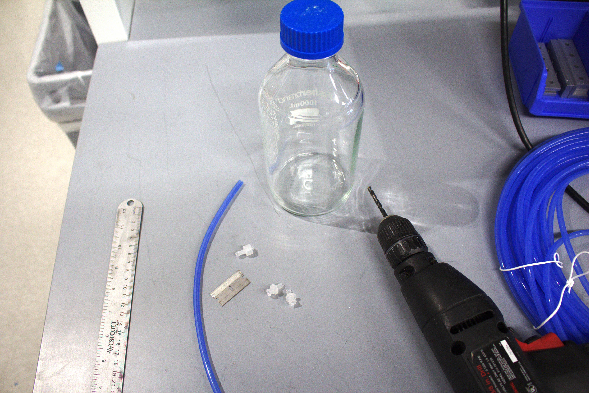
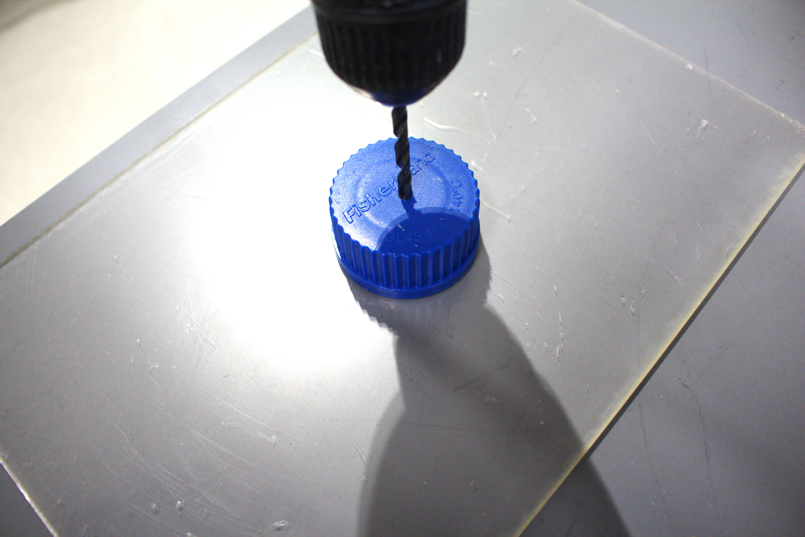
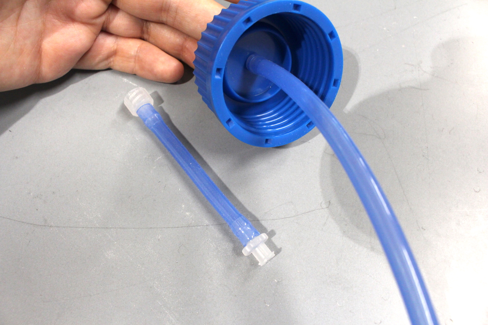
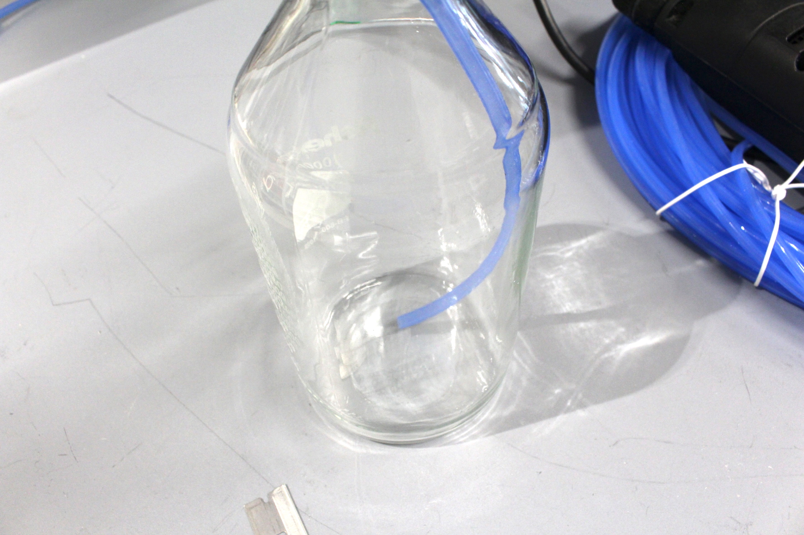
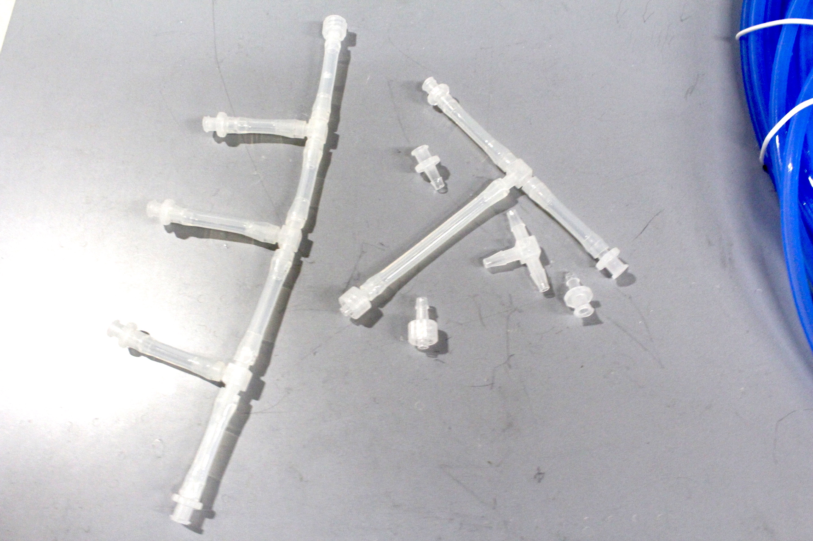

# Making media bottles and splitters

While large carboys (autoclavable plastic jugs >10L) are useful for long-term experiments or particularly fast-growing bugs, the best typical media storage is standard Pyrex/Corning bottles, which range from 100 mL to 10 L. The 1-2L bottles are the most convenient size for media prep, short experiments, and experiments with many media types, so we'll be sharing the process for those bottles here.

Per media bottle, you will need (see [parts list](../getting-started/part-sourcing.md), fluidics page):

Parts:\
1 ft of 1/8" ID silicone tubing\
2 Female luer-lock connector with 1/8" barb, polypropylene\
1 Male luer-lock connector with 1/8" barb, polypropylene\
1 Male luer cap\
Tools:\
Scissors/razor\
Drill gun\
3/16" drill bit

First, drill a hole directly down through the cap. Be sure to have something safe to drill into on the other side. If having trouble with the 3/16 bit catching on the plastic, drill a pilot hole with a smaller bit.

Next, push one of the barbed female luer connectors through the top of the cap, so the luer side is facing up.&#x20;

Next, cut two pieces of tubing. One is for the cap above, and can be as short as 3". Put the two remaining luer adapters (one male, one female) on this piece. This flexible piece makes it a little easier to connect lines to bottles. The other should be at least 9" so that it makes it from the barb on the cap all the way to the bottom of the bottle (for 1L bottles). \
\
Connect the longer piece of tubing to the barb poking through the bottom of the lid.

The long straw should reach the bottom of the bottle and bend slightly. If it’s too long it will be annoying to screw the bottle cap on, and might get stuck against the wall. If it's too short, it won’t be able to reach media at the bottom of the bottle. Your bottles may vary: for 2L bottles, you need a 13" straw.

Rinse out the straw with diH2O, and add a male luer cap to the top of the straw before autoclaving, and you’re good to go!

.jpeg>)

You can also make splitters with the same 1/8" tubing and corresponding luer-barb connectors and barbed T-connectors, allowing you to split one media bottle to multiple input lines. We usually sterilize the splitters using 10% bleach and ethanol (by connecting them before sterilizing all the lines when beginning  an eVOLVER experiment), but everything shown here is autoclavable as well.

Note: The original [forum post](https://www.evolver.bio/t/making-bottles-and-media-splitters/63) called for 5/32" barbs and 1/8" inner diameter tubing. While this will work for soft silicone tubing, it does not work for more firm tubing or some barb styles. We advise that you always match the barb size rating to the tubing inner diameter; i.e. always use 1/8" barbs for 1/8" ID tubing, and 5/32" barbs for 5/32" ID tubing. Both diameters of tubing have similarly good stiffness and flow properties for routing media, but 1/8" barb fittings and tubing are slightly cheaper, so we generally opt for those.
