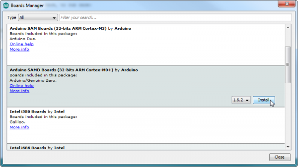
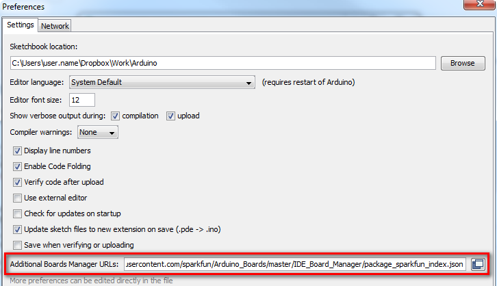
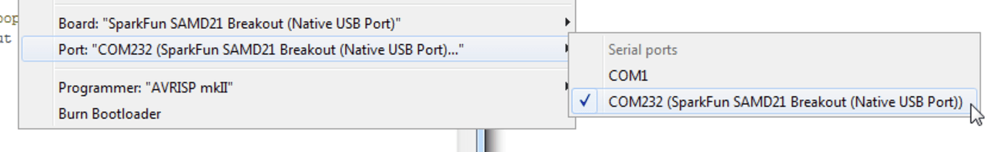

# Arduino Software Installation

If you have any questions or hit a roadblock, check [this post](https://www.evolver.bio/t/installing-arduino-libraries-and-uploading-code/156) on the forum.

### 1. Download the Arduino IDE

[Their website](https://www.arduino.cc/en/software) should be fairly easy to navigate.


### 2. Install SAMD libraries

The Sparkfun website has [a very good blog](https://learn.sparkfun.com/tutorials/samd21-minidev-breakout-hookup-guide/setting-up-arduino) on this. For more details, please refer to that link. The following is information copied from there.

> Navigate to your board manager ( **Tools** > **Board** > **Boards Manager…** ), then find an entry for **Arduino SAMD Boards (32-bits ARM Cortex-M0+)** . Select it, and install the latest version to your board manager ( **Tools** > **Board** > **Boards Manager…** ), then find an entry for **Arduino SAMD Boards (32-bits ARM Cortex-M0+)** . Select it, and install the latest version



### 3. Install the Sparkfun libraries for the SAMD21

> First, open your Arduino preferences ( **File** > **Preferences** ). Then find the **Additional Board Manager URLs** text box, and paste the below link in

```
https://raw.githubusercontent.com/sparkfun/Arduino_Boards/master/IDE_Board_Manager/package_sparkfun_index.json
```



> Then hit “OK”, and travel back to the **Board Manager** menu. You should (but probably won’t) be able to find a new entry for **SparkFun SAMD Boards** . If you don’t see it, close the board manager and open it again.


### 4. Choose the correct BOARD and PORT to upload into

The boards used in eVOLVER are the SAMD21 Mini boards. The port changes based on which USB the Arduino is connected to. The wrong port is typically the most common reason why the Arduino won’t upload.&#x20;

**Choosing the board:**


**Choosing the port:**



### 5. Download the Arduino scripts and copy eVOLVER libraries into Arduino folder

The scripts can be found on our [Github Page](https://github.com/FYNCH-BIO/evolver-arduino). After downloading the scripts, please copy the libraries folder into your local Arduino libraries folder. For example, on my computer, it is under **Documents > Arduino > libraries**

Copy these files into your local Arduino libraries folder.


### **6. Upload script to Arduino!**

This should be all. Open up the files and upload your scripts to the microcontroller via microUSB! A quick tip: there are many poorly designed microUSB cables out there (e.g. just for charging). Be careful to use one that you know works. If you can’t upload, try another cable.


