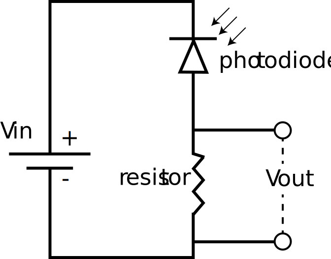

# Motherboard Layout and Circuitry

## General Information

As a quick recap, the Motherboard is designed to collect and send data/power to all 16 Smart Sleeves. The Motherboard is essentially a large PCB used to route signals via a network of electrical traces. Each SA slot (8 total) posses two electrical connections (positive and negative leads) to each Smart Sleeve CMB (8\*2=16 connections per CMB). These two leads per SA slot are then used to make the physical connections to a sensor/actuator. In total, this results in **2** (leads per sensor/actuator) **\* 8** (SA slots) **\* 16** (number of Smart Sleeves) **= 256 total traces.** This is important to keep in mind when modifying the Smart Sleeve or troubleshooting when problems arise.

Lastly, each SA slot acts as a de-multiplexer/multiplexer for bidirectional relay of signals with its cognate SAMD21 Arduino.&#x20;

TODO: Include a figure to highight transfer of data including voltage divider

## Tuning Sensor Behavior

As mentioned earlier, the Motherboard makes use of voltage divider circuits to acquire sensory data on cultures. Briefly, a voltage divider circuit works by connecting two resistors in series with Vin, a voltage source, to produce Vout, a set fraction of Vin (Fig 1.). The value of Vout is based on the the resistance values of the two resitors and the value of Vin, which can be modeled as:

$$
Vout = Vin *R2/(R1+R2)
$$

<figure><figcaption>
Figure 1. Basic voltage divider circuit
</figcaption></figure>

This principle is used by the Motherboard to implement sensory circuits with components that transduce environmental signals into electrical signals (i.e. thermistors, photodiode, phototransistors, etc). This signal is read via Vout, the voltage across the resistor, which is proportional to the sensor's electrical readout (Fig 2.).

<figure><figcaption>
Figure 2. Optical density sensor circuit using a photodiode sensor to transduce changes in light.
</figcaption></figure>

Based on experimental conditions, it may be of interest to tune how these sensory circuits behave to acquire optimal data. The Motherboard offers two primary ways to modify sensory circuits: 1) swap R1 to alter sensor sensitivity and 2) swap Vin to alter the circuit's dynamic range.

### Tuning Sensor Sensitivity

To streamline sensitivity tuning, the Motherboard uses 9-pin resistor packs (one is reserved for ground), which connect to the left-and-right to each SA slots (8\*2=16 parallel resistors). As a user, all you need to do is remove the two current resistor packs and replace them with packs with desired resitance values. By taking a look at the raw sensory data coming off the eVOLVER, you can assess if the sensitivity modifications are adequate or not.&#x20;


Resitor packs are polarized electrical components so ensure that the ground pin (with dot) is properly put into the female ground connector on the Motherboard.



Avoid bending or breaking pins when removing/placing resistor packs. Use pliers to gently pull up on both ends to nudge the resistor pack out&#x20;

