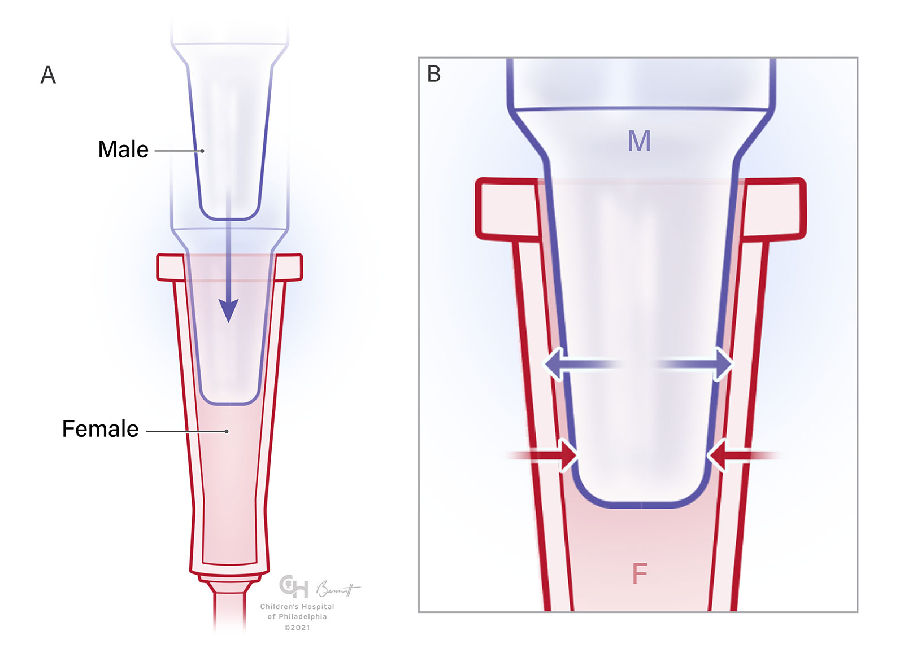
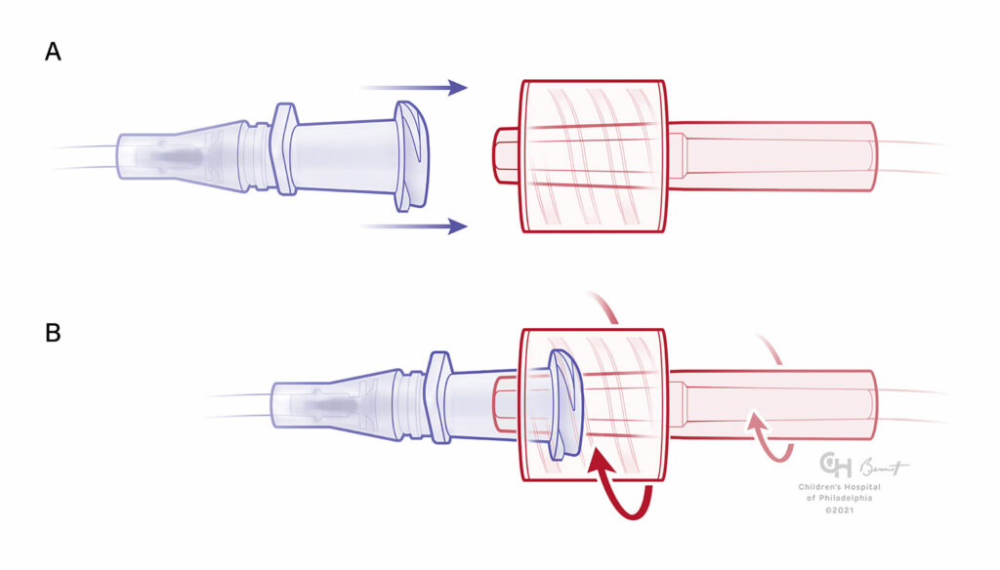

# Tubing and connectors


For reference: Inner diameter = ID, Outer diameter = OD. Quotation marks (") indicate inches, single apostrophe (') indicates feet. Most eVOLVER hardware is in US customary units (i.e. not metric) due to wider availability of parts.


## Standard components

### Tubing

The standard eVOLVER package includes 1/16" ID  (1/8" OD) soft silicone tubing for all fluid handling operations. For exact specifications, see the [part sourcing google sheet](../../getting-started/part-sourcing.md#guidelines), "Fluidics" tab.

Silicone is the tubing of choice for eVOLVER because of its flexibility, durability, cost, and resistance to beach and ethanol. It is also autoclavable, although 30 minutes of 10% bleach sterilization is sufficient to completely sterilize the lines.

Silicone tubing is highly permeable to gasses, including water vapor. If you leave media in the tubing for >1 week, it will likely dry out and cause an obstruction (see [obstruction troubleshooting](tubing-and-connectors.md#obstructions)).

### Connectors

The standard eVOLVER package includes 1/16" barb to luer-lok connectors for all pump-to-vial connections. For exact specifications, see the [part sourcing google sheet](../../getting-started/part-sourcing.md#guidelines), "Fluidics" tab.

The barb side of the connector is rated for the ID of tubing it is mean to be used with, i.e. 1/16" barb for 1/16" ID tubing, 1/8" barb for 1/8" ID tubing, etc. Barbs are designed to get a tight seal around their widest diameter, with the max pressure and resistance to slippage depending on the softness of the tubing and style of barb (40 psi for standard eVOLVER connectors).

Luer connectors work by pressing a "male" plug into a "female" socket, both tapered at 6%. Because of the smooth surfaces and large contact area, this creates an effective seal without tools, held in place by friction. Syringes and medical equipment commonly make use of luer connections.

<figure><figcaption>
Luer-slip connector
</figcaption></figure>

To hold luer connections in place more securely, luer-lok connectors use a screw-like "skirt" to prevent luer connectors from simply being pulled apart. eVOLVER tubing connections are luer-lok, allowing for easy but relatively secure connections between most components.

<figure><figcaption></figcaption></figure>

However, luer-lok connections have some common failure modes. Because the threads of the skirt are so coarse, it only takes a 1/4 turn to break the seal at the plug-socket interface, leading to a leak (if positive pressure) or air bubble source (if negative pressure). Loose luer connections easily become disconnected, leading to spills (the major source of electronics failure) and of course, failed experiments. One should always ensure luer connections are snug (hand tight), and tubing free from torsion that might unscrew the luer-lok.

Additionally, because the male connector comes in direct contact with fluid, it becomes your most likely contamination source. Be careful not to bump the tips of the male connectors against contaminated surfaces when setting up your experiment. Doing a final wash with 70% ethanol after bleach sterilizing can prevent some contamination from this route, depending on your media and organism.

For more information on luer connections (and credit for the above images), see here: [https://www.apsf.org/article/managing-luer-connections/](https://www.apsf.org/article/managing-luer-connections/)

## Troubleshooting and repair

### Obstructions

For the pumps that we typically use for eVOLVER, 1/16" ID tubing does not resist flow in any appreciable amount. When there is an obstruction in the line, from dried media or biofilm, the peristaltic pumps can produce up to 45 psi of pressure, which is enough to exceed the barbed connector tolerance and burst barb connections. This is clearly undesirable, so if you find that one of your barb connections has burst, check the length of the line for obstructions. If it's an efflux line to the waste container (opaque), assume it has an obstruction. Biofilm obstructions can happen during long experiments with a biofilm-forming organism like _E. coli_ - your best bet is to pause the experiment and bleach sterilize all lines before restarting. If your line is completely blocked, either replace the line or clear the obstruction by pushing water through the line with a 50 mL syringe.

### Stuck luer-lok connectors

Residual or leaked media on the ends of luer-lok connectors can dry and leave the connectors stuck. Rather than reach for a pair of plyers, soak the connection in hot water to dissolve the media. This can also help for any stubborn fluidic connection, and make tubing much more pliable.

## Swapping and modifying

Any soft tubing (durometer 40-70A) works well with the barbed connectors. Vinyl (PVC) or tygon tubing might be a suitable alternative for decreased permeability. Opaque tubing may make sense for light-sensitive media or antibiotic feeds that have extended time exposed to light in the tubing due to low flow rates, at the cost of not being able to observe media in your line. Remember that 1/16" ID tubing contains about 0.75 mL per foot.
