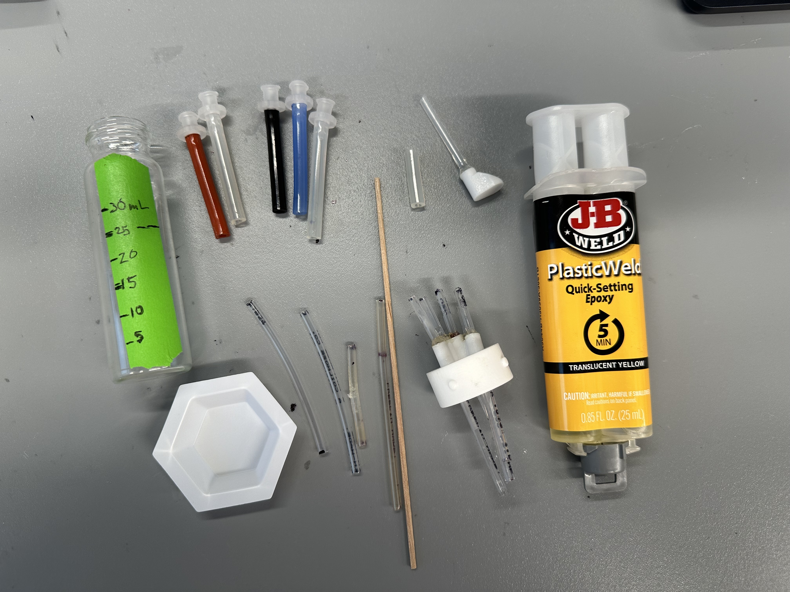
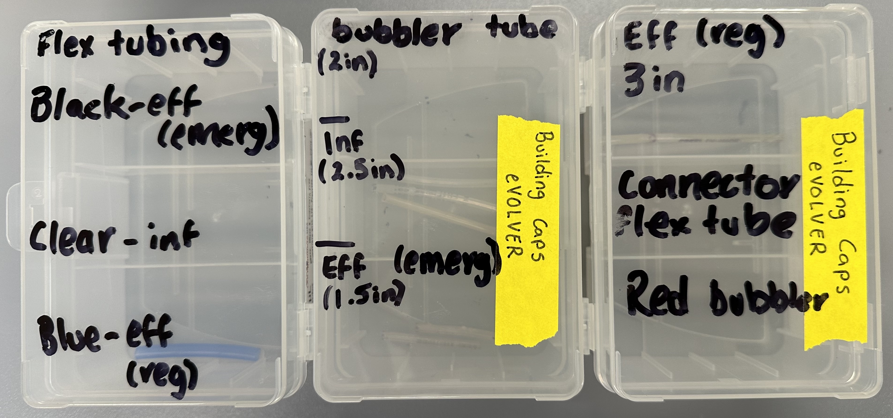
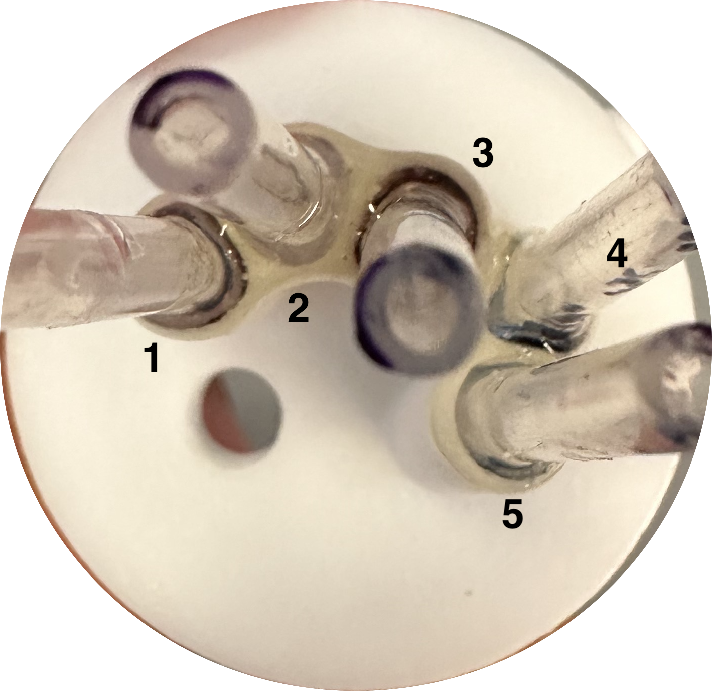
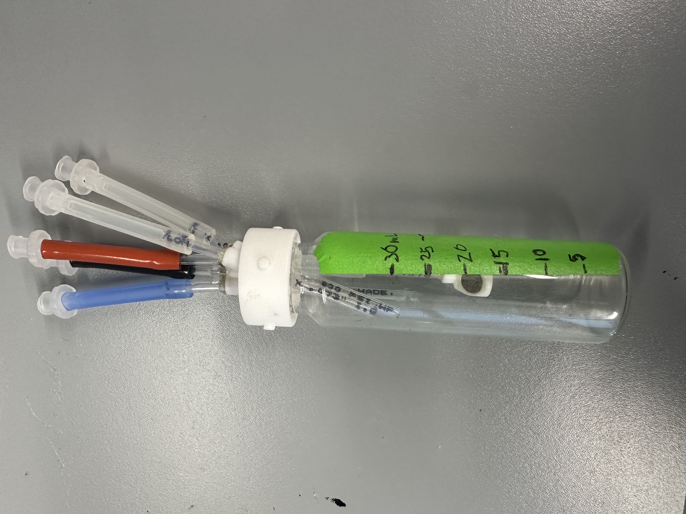
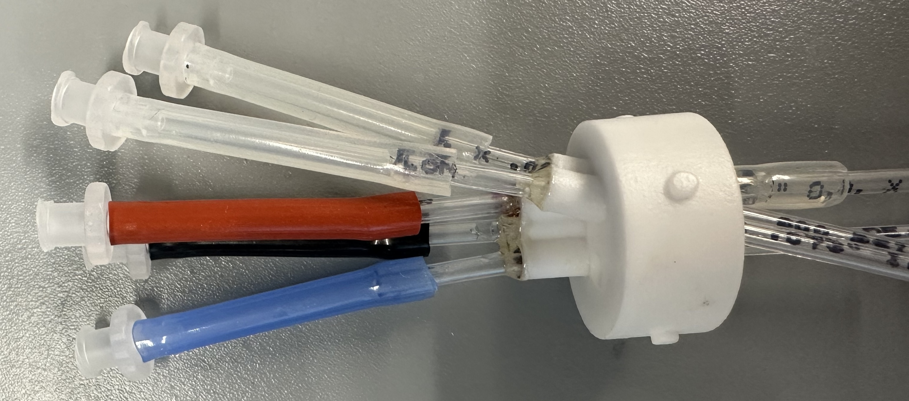
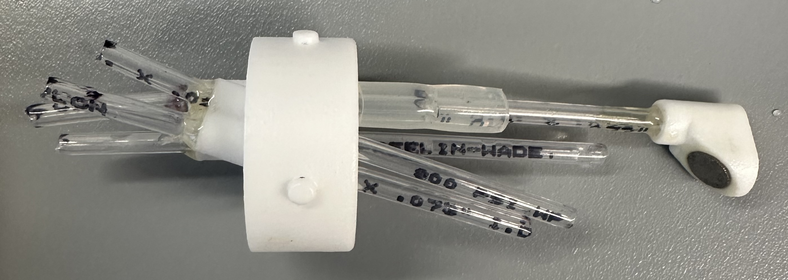

# 5 and 7 Port Nylon Tubing Caps Construction Protocol

<figure><figcaption>
Example cap with 5 ports, one of which is a <a href="../../extensions/custom-fluidics/bubblers-in-vial-aeration/">bubbler</a> [optional].
</figcaption></figure>

## Materials

* 3D printed vial cap with ports for nylon tubing
  * [Download](https://github.com/FYNCH-BIO/hardware/tree/master/Smart%20Sleeve/vial_cap/5_and_7_port_nylon_tube) the .stl file from GitHub
  * Order from [Hubs](https://hubs.com/)
    * Service = SLS; material = nylon PA-12
    * Get "vapor smoothed" for better sealing
* [Plasticweld epoxy](https://www.mcmaster.com/7605A5/)
* [Semi-clear white hard nylon tubing](https://www.mcmaster.com/9685T1/) (1/8" OD)&#x20;
* [White](https://www.mcmaster.com/51135K14/) flexible silicone rubber tubing (3/32" ID (inner diameter))&#x20;
* [Blue](https://www.mcmaster.com/5236K821/) flexible silicone rubber tubing (3/32" ID (inner diameter))
* Five 3/32" female barb to luer [connectors](https://www.mcmaster.com/51525K292/)
* Mixing tray (here a small weighboat)&#x20;
* Disposable applicator (here a wooden stir stick; pipette tip also works)
* \[Optional - for color coding ports] [Red](https://www.mcmaster.com/5236K32/) flexible silicone rubber tubing (3/32" ID (inner diameter))
* \[Optional - for color coding ports] [Black](https://www.mcmaster.com/5236K822/) flexible silicone rubber tubing (3/32" ID (inner diameter))
* \[Optional] 3D printed (SLS, nylon PA-12, vapor smoothed) [bubbler](../../extensions/custom-fluidics/bubblers-in-vial-aeration/) for in-vial aeration

<figure><figcaption>
Materials needed for cap assembly. Instructions for making glass vial with graduations below.
</figcaption></figure>

## Design

1. Choose the minimum number of ports necessary
   1. You will need to block up ports that are unused if you want to do emergency efflux
   2. Therefore, choose the cap with the minimum number of ports that you need
   3. For example, counting ports for PACE
      1. Lagoon: 1 vial-to-vial + 1 efflux + 2 inducers + 1 emergency efflux = 5 ports
      2. Cell reservoir: 1 media influx + 1 efflux + 1 vial-to-vial + 1 emergency efflux = 4 ports
      3. For simplicity, you may want to just use this type of cap and plug the extra port with a luer [cap](https://www.mcmaster.com/51525K311/).
2. Efflux straw sets the volume of the culture
3. Increase influx accuracy
   1. **Important for low volume influx like inducers**
   2. Angled influx tubing should touch the inside of the glass vial to create a stream of liquid rather than drops.
   3. It should also be well above the efflux line to avoid contamination.
4. \[Optional] Use different colors of tubing to denote different ports (see above)

## Construction Protocol

### 0. Mark fluid lines on a glass eVOLVER vial (see above image)

1. This will be used to set the efflux tube height, which sets the volume in the eVOLVER vial.
2. Tape an eVOLVER vial
3. Using a serological pipette, measure water into the vial in increments of 5 mL
4. Mark the volume at each increment on the tape at the bottom of the [meniscus](https://en.wikipedia.org/wiki/Meniscus_\(liquid\))

### 1. Cut Nylon Tubing to Various Lengths Needed


**Tip:** To keep things tidy and make the process of constructing the cap easier, cut everything you need first and store in clearly labeled old micropipette tip boxes.


<figure><figcaption>
Optional: When making multiple caps, it is easier to keep track of the varying lengths of tubing by storing them in old pipette tip boxes. 
</figcaption></figure>


The nylon tubing will straighten in the autoclave.


1. Cut the necessary components of the hard semi-clear white nylon tubing (1/8" OD). Refer to the table below for lengths.

The table below has the necessary components for the construction of **one cap**.&#x20;

<table><thead><tr><th>Component</th><th width="249">Length</th></tr></thead><tbody><tr><td>1 x Regular Efflux (culture volume of 25 mL)</td><td>3 inches</td></tr><tr><td>1 x Emergency Efflux</td><td>1.5 inches</td></tr><tr><td>2 x Influx</td><td>2.5 inches</td></tr><tr><td>1 x Gas Bubbler</td><td>2 inches</td></tr></tbody></table>

2. Cut the necessary components of the flexible nylon tubing. Refer to the table below for lengths.&#x20;

The table below has the necessary components for the construction of **one cap.**

<table><thead><tr><th>Component</th><th width="249">Length</th><th>Flexible Tubing Color</th></tr></thead><tbody><tr><td>1 x Regular Efflux</td><td>1.5 inches</td><td>Blue</td></tr><tr><td>1 x Emergency Efflux</td><td>1.5 inches</td><td>Black</td></tr><tr><td>2 x Influx </td><td>1.5 inches</td><td>Clear</td></tr><tr><td>1 x Gas Bubbler </td><td>1.5 inches</td><td>Red</td></tr><tr><td>1 x Bubbler Connector </td><td>5/8 inches</td><td>Clear</td></tr></tbody></table>

### 2. Assemble Cap


When handling epoxy, use gloves to avoid getting it on skin as it can eventually lead to allergic reactions.


**Steps**

1. You may need to drill out the ports in the 3D printed vial cap if powder is blocking them.
2. Insert the hard semi-clear white nylon tubing (1/8" OD) into each corresponding port in the cap as per the image below.

<figure><figcaption>
1. Influx, 2. Influx, 3. Gas Bubbler, 4. Emergency Efflux, 5. Regular Efflux
</figcaption></figure>

3. Screw the cap into the glass vial with measuring tape on the side and ensure that:

* [ ] The 2 influx tubes **ARE** touching the edge of the vial. They should be staggered such that one is higher than the other.&#x20;
* [ ] \[Bubbler Only] Bubbler tube is at the 15mL line on the vial.&#x20;
* [ ] \[Bubbler Only] Bubbler **IS** **NOT** touching the edges of the vial and is facing the sampling port (rotate and adjust as necessary to ensure this).

<figure><figcaption></figcaption></figure>

4. Follow the epoxy directions to mix up a small amount of epoxy in a disposable dish. Use even pressure to get even amounts of resin and hardener. Use a toothpick or other similarly sized applicator to put the minimum amount of epoxy around the outside area of the cap where the ports and the hard nylon tubing connect, ensuring to spread the epoxy in between any gaps.
5. Set assembled caps upright (with a vial rack or spare vials) so that epoxy doesn't drip into the sampling port as it cures.
6. Set cap on its side to cure overnight.&#x20;
7.  Next day, add the appropriate color flexible nylon tubing (3/32" ID) to each hard nylon tubing (1/8" OD) as per the table above.

    <figure><figcaption>
Color flexible tubing connected to cap.
</figcaption></figure>

    3. \[Bubbler Only] Connect the flexible nylon tubing (3/32" ID) bubbler connector component onto the inside end of the gas bubbler hard tubing. Allow the tubing to reach halfway through the connector tubing.&#x20;

    <figure><figcaption></figcaption></figure>

    4. \[Bubbler Only] Connect the constructed gas bubbler onto the other side of the connector tubing. The end of the gas bubbler hard tubing that is inserted in the cap and the gas bubbler should connect as per image below.&#x20;

    <figure><figcaption></figcaption></figure>
