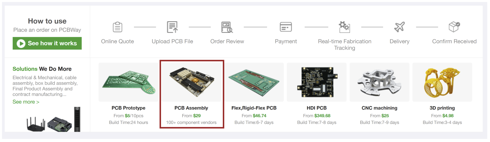

# 5 and 7 Port Nylon Tubing Caps Construction Protocol

<figure><figcaption>
Example cap with 5 ports, one of which is a <a href="../../extensions/custom-fluidics/bubblers-in-vial-aeration/">bubbler</a>.
</figcaption></figure>

## Materials

* 3D printed (SLS, nylon PA-12) vial cap with ports for nylon tubing
  * [Download](https://github.com/FYNCH-BIO/hardware/tree/master/Smart%20Sleeve/vial_cap/5_and_7_port_nylon_tube) the .stl file from GitHub
  * Order from [Hubs](https://hubs.com/)
  * Get these "vapor smoothed" for better sealing
* \[Optional] 3D printed (SLS, nylon PA-12) [bubbler](../../extensions/custom-fluidics/bubblers-in-vial-aeration/) for in-vial aeration
* [Plasticweld epoxy](https://www.mcmaster.com/7605A5/)&#x20;
* [Semi-clear white hard nylon tubing](https://www.mcmaster.com/9685T1/) (1/8" OD)&#x20;
* [White](https://www.mcmaster.com/51135K14/) flexible silicone rubber tubing (3/32" ID (inner diameter))&#x20;
* [Blue](https://www.mcmaster.com/5236K821/) flexible silicone rubber tubing (3/32" ID (inner diameter))
* [Red](https://www.mcmaster.com/5236K32/) flexible silicone rubber tubing (3/32" ID (inner diameter))
* [Black](https://www.mcmaster.com/5236K822/) flexible silicone rubber tubing (3/32" ID (inner diameter))
* \[Recommended] [Rubber stopper ](https://www.mcmaster.com/9277K37/)
* \[Recommended] [O ring](https://www.mcmaster.com/1171N163/)

## Design

Talk about the different lengths of nylon tubing and why they are that length

Angled influx tubing

## Construction Protocol

### 1. Cut Nylon Tubing to Various Lengths Needed


**Tip:** To keep things tidy and make the process of constructing the cap easier, cut everything you need first and store in clearly labeled old micropipette tip boxes.


<figure><figcaption>
Optional: When making multiple caps, it is easier to keep track of the varying lengths of tubing by storing them in old pipette tip boxes. 
</figcaption></figure>


The nylon tubing will straighten in the autoclave.


1. Cut the necessary components of the hard semi-clear white nylon tubing (1/8" OD). Refer to the table below for lengths.

The table below has the necessary components for the construction of **one cap**.&#x20;

<table><thead><tr><th>Component</th><th width="249">Length</th></tr></thead><tbody><tr><td>1 x Regular Efflux</td><td>3 inches</td></tr><tr><td>1 x Emergency Efflux</td><td>1.5 inches</td></tr><tr><td>2 x Influx</td><td>2.5 inches</td></tr><tr><td>1 x Gas Bubbler</td><td>2 inches</td></tr></tbody></table>

2. Cut the necessary components of the flexible nylon tubing (3/32" ID). Refer to the table below for lengths.&#x20;

The table below has the necessary components for the construction of **one cap.**

<table><thead><tr><th>Component</th><th width="249">Length</th><th>Flexible Tubing Color</th></tr></thead><tbody><tr><td>1 x Regular Efflux</td><td>1 7/8 inches</td><td>Blue</td></tr><tr><td>1 x Emergency Efflux</td><td>1 7/8 inches</td><td>Black</td></tr><tr><td>2 x Influx </td><td>1 7/8 inches</td><td>Clear</td></tr><tr><td>1 x Gas Bubbler </td><td>1 7/8 inches</td><td>Red</td></tr><tr><td>1 x Bubbler Connector </td><td>5/8 inches</td><td>Clear</td></tr></tbody></table>

### 2. Assemble Cap

<figure><figcaption>
Materials needed for cap assembly.
</figcaption></figure>

**Materials**

1. Mixing tray (here a small weighboat)&#x20;
2. Disposable applicator (here a toothpick)
3. Nylon tubing cut to length (as per step 1)
4. [Plasticweld epoxy](https://www.mcmaster.com/7605A5/)&#x20;
5. Gas bubbler (already constructed - see here for [bubbler construction protocol](../../extensions/custom-fluidics/bubblers-in-vial-aeration/bubbler-construction-protocol.md))
6. 3D printed (SLS, nylon PA-12) vial cap with ports for nylon tubing
7. Glass eVOLVER vial with graduated tape on the side&#x20;
8. Five 3/32" barbs _<mark style="background-color:red;">**ADD LINK TO BARB (Dany doesn't know this)**</mark>_

**Steps**

1. You may need to drill out the 3D printed caps if powder is blocking the inlet ports. Use a _<mark style="background-color:red;">**ADD  drill bit**</mark>_
2. Insert the hard semi-clear white nylon tubing (1/8" OD) into each corresponding port in the cap as per the image below.

<figure><figcaption>
1. Influx, 2. Influx, 3. Gas Bubbler, 4. Emergency Efflux, 5. Regular Efflux
</figcaption></figure>

2. Add the appropriate color flexible nylon tubing (3/32" ID) to each hard nylon tubing (1/8" OD) as per the table above.

<figure><figcaption>
Color flexible tubing connected to cap.
</figcaption></figure>

3. Connect the flexible nylon tubing (3/32" ID) bubbler connector component onto the inside end of the gas bubbler hard tubing. Allow the tubing to reach halfway through the connector tubing.&#x20;

<figure><figcaption></figcaption></figure>

4. Connect the constructed gas bubbler onto the other side of the connector tubing. The end of the gas bubbler hard tubing that is inserted in the cap and the gas bubbler should connect as per image below.&#x20;

<figure><figcaption></figcaption></figure>

5. Screw the cap into the glass vial with measuring tape on the side and ensure that:

* [ ] Bubbler tube **IS** **NOT** touching the edges of the vial and is facing the sampling port (rotate and adjust as necessary to ensure this).
* [ ] The 2 influx tubes **ARE** touching the edge of the vial. They should be staggered such that one is higher than the other.&#x20;
* [ ] Bubbler tube is at the 15mL line on the vial.&#x20;
* [ ] The red, black and blue tubing should be approximately the same height.

<figure><figcaption></figcaption></figure>

6. Use gloves to avoid getting epoxy on your hands.
7. Follow the epoxy directions to mix up a small amount of epoxy in a disposable dish. Use even pressure to get even amounts of resin and hardener. Use a toothpick or other similarly sized applicator to put the minimum amount of epoxy around the outside area of the cap where the ports and the hard nylon tubing connect, ensuring to spread the epoxy in between any gaps.
8. Set assembled caps upright (with a vial rack or spare vials) so that epoxy doesn't drip into the sampling port as it cures.
9. Set cap on its side to cure overnight.&#x20;
