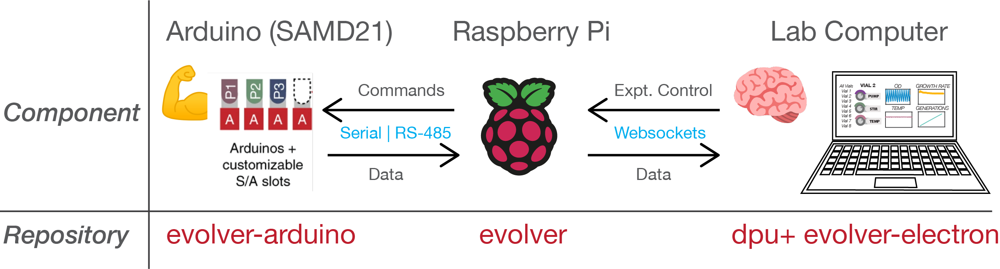

# Overview of Software Architecture

All code is located in our [Github Repositories](https://github.com/FYNCH-BIO):

1. [eVOLVER Code](https://github.com/FYNCH-BIO/evolver) (Raspberry Pi, Python)
2. [Arduino/Microcontroller Code](https://github.com/FYNCH-BIO/evolver-arduino) (C/C++)
3. [Data Processing Unit](https://github.com/FYNCH-BIO/dpu) (Python)
4. [eVOLVER GUI](https://github.com/FYNCH-BIO/evolver-electron) (Node, JS, Electron, React)

### **Arduino (SAMD21)**

Responsible for collecting data from sensors and actuating culture vial components. A single [SAMD21 mini-breakout board](https://www.sparkfun.com/products/13664) is typically responsible for a single culture parameter. All of the SAMD21 boards are connected in parallel to a [Serial RS-485 bus](https://www.cuidevices.com/blog/rs-485-serial-interface-explained). They listen for commands from the Raspberry Pi and communicate only when the RPi asks them specifically for information.

All code is in C/C++.

### **Raspberry Pi**

The Raspberry Pi orchestrates the control of all connected components, keeps track of calibration data for those components, and serves as the interface between the hardware and any lab computers or users wanting to interact with the eVOLVER. It can communicate via a network and also interface with low-level hardware. It communicates with the connected Arduino's via Serial RS-485, and with users via a lab computer with [websockets](https://www.wallarm.com/what/a-simple-explanation-of-what-a-websocket-is), typically over a local network (router).

The server is written in python.

### **Lab Computer**

This is where the logic for experiments happens. Users can program culture routines in python (DPU) that are carried out as commands sent to the RPi via websockets typically over a local network (router).&#x20;

Additionally, users can use the electron GUI interface to send immediate one-off commands and see the current data being collected on the eVOLVER. The GUI is also used to carry out calibrations of connected components, mapping the currents and voltages that the sensors generate to real-world representation of what they are measuring like OD or temperature.

Lastly, the GUI is also capable of customizing and managing eVOLVER culture routine experiments, and can be used to view the data from current and past experiments.

The DPU code is all in python, and the GUI is written in Javascript using [Electron](https://www.electronjs.org/) and [React](https://reactjs.org/).
