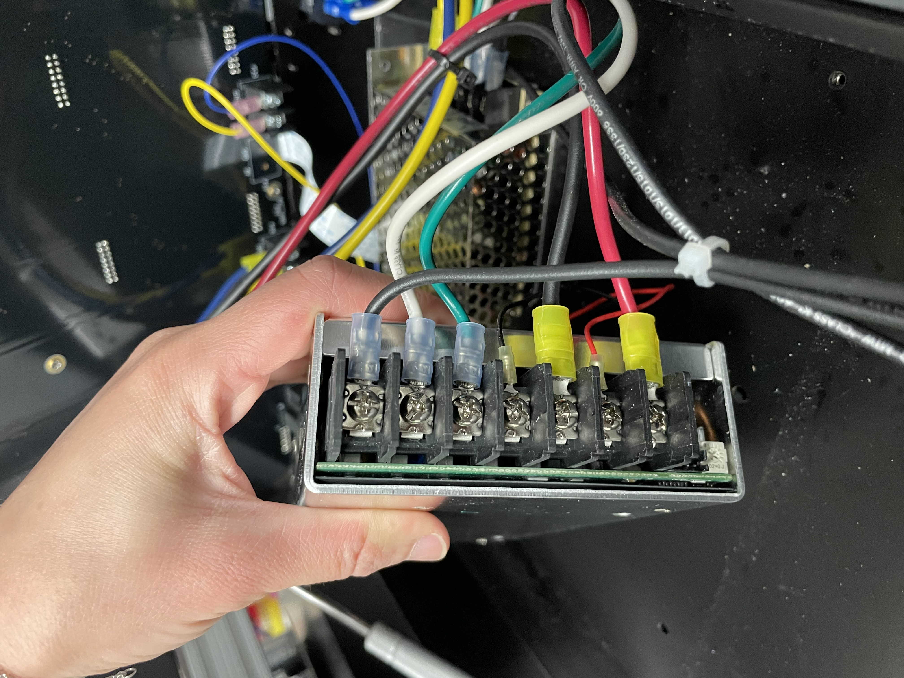
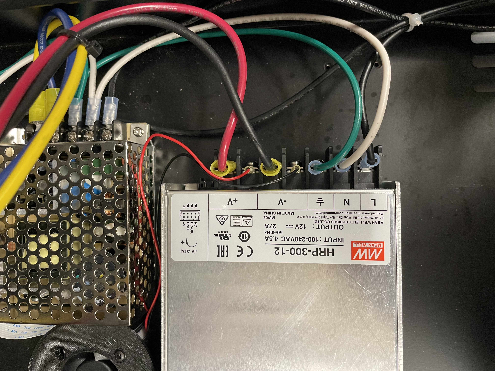

# 12V Power Supply Troubleshooting/Replacement

The 12V power supply powers the heating and stirring elements in the Smart Vials. If both of these elements are not properly functioning and you have inspected the internal circuitry for damage (see [motherboard-troubleshooting-replacement.md](motherboard-troubleshooting-replacement.md "mention") for more information), the next element to check is the 12V power supply.&#x20;

## Troubleshooting

* measuring w multimeter?

## Replacing a 12V Power Supply

If you have found that the 12V power supply is not functioning, you can replace it following the steps below.


Before getting started, be sure to unplug the eVOLVER from the wall outlet.&#x20;


1. The 12V power supply is fastened to the bottom of the vial platform with 4 hexagonal bolts. Use an Allen wrench to remove these bolts.

<figure><figcaption>
Bottom view of eVOLVER: 12V power supply volts are circled in red
</figcaption></figure>

2. Unscrew the wiring that connects the motherboard to the 12V power supply using a flathead screwdriver. This is easiest to do when the power supply has been unfastened from the case so that it can be turned on its side.

<figure><figcaption>
Side view: wiring that connects the 12V power supply to the motherboard
</figcaption></figure>

3. Attach the wiring to the replacement 12V power supply, making sure that the wires are in the correct configuration, as shown below.

<figure><figcaption>
Top view: 
</figcaption></figure>
