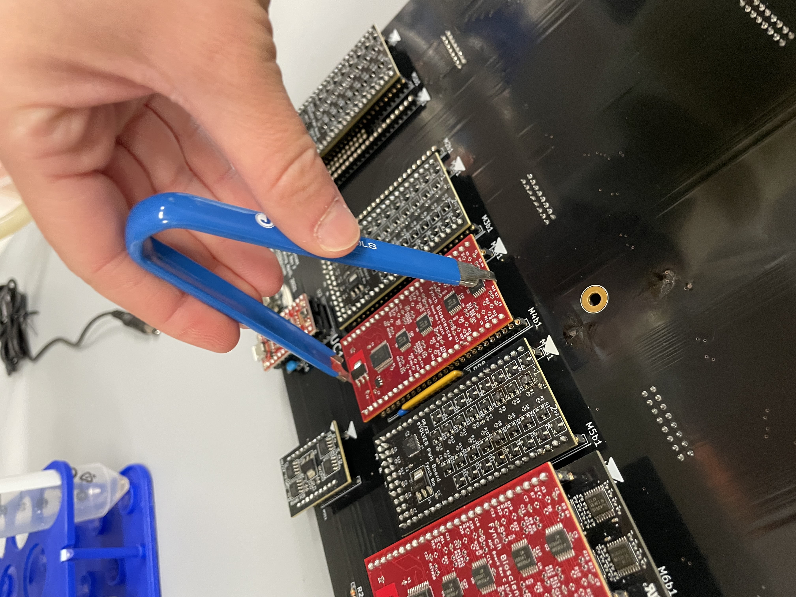
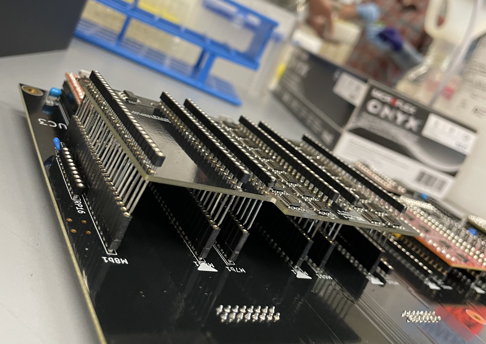
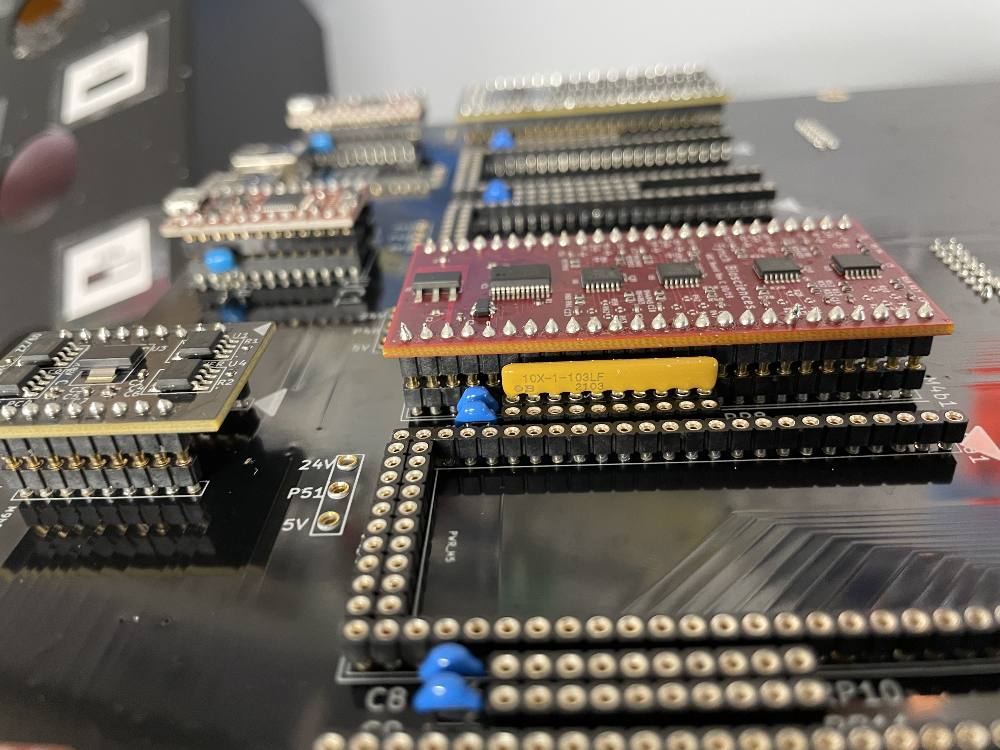
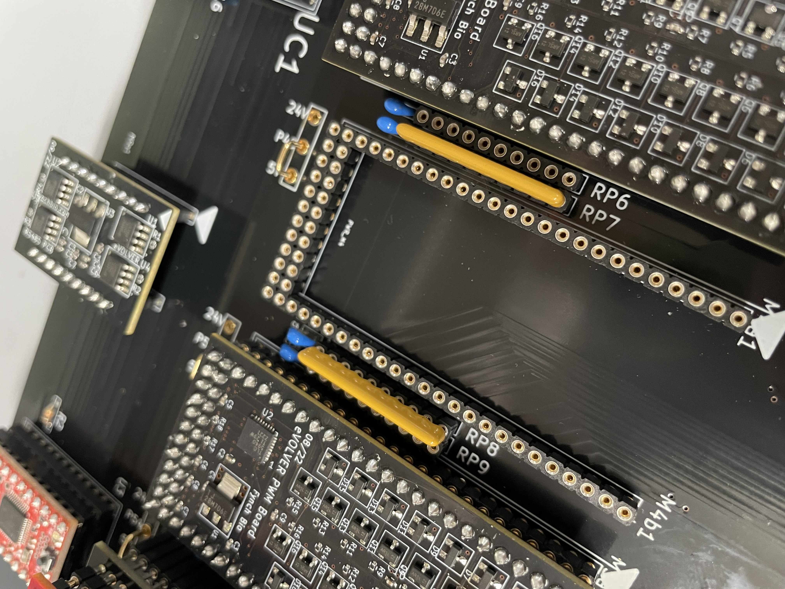
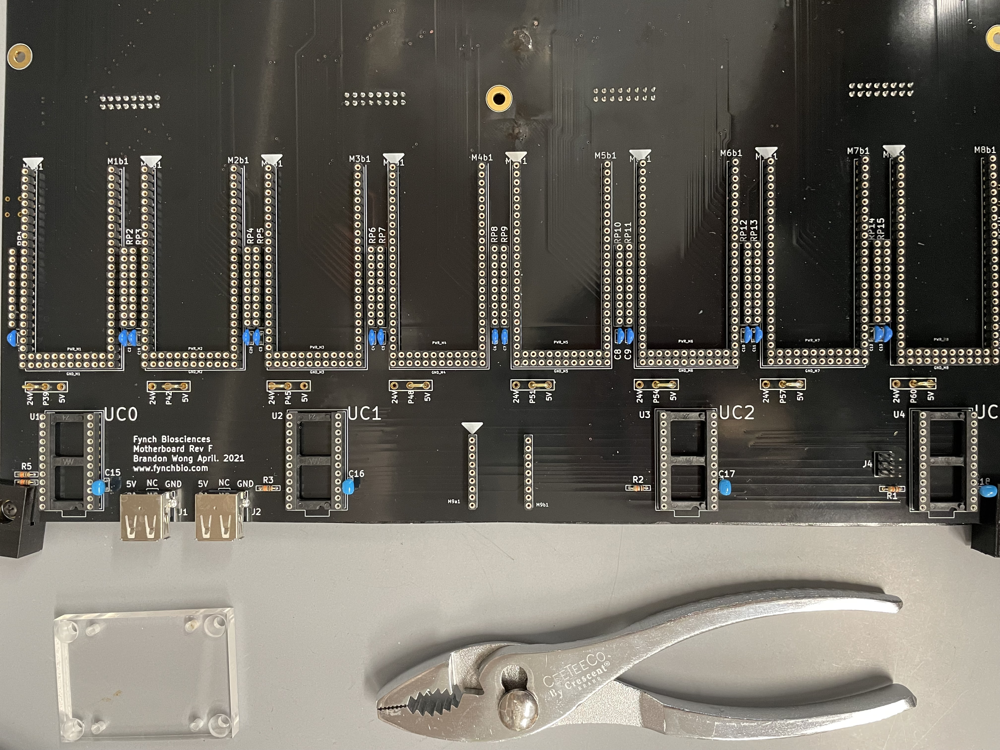
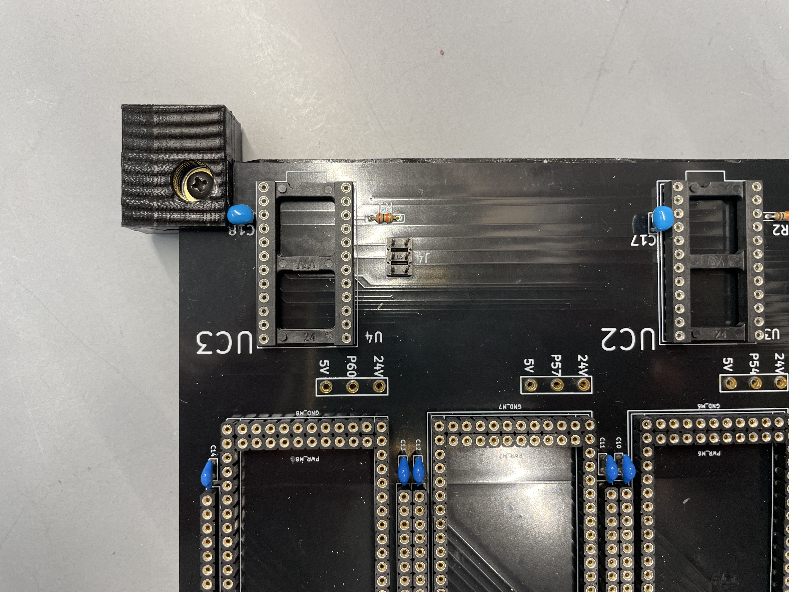
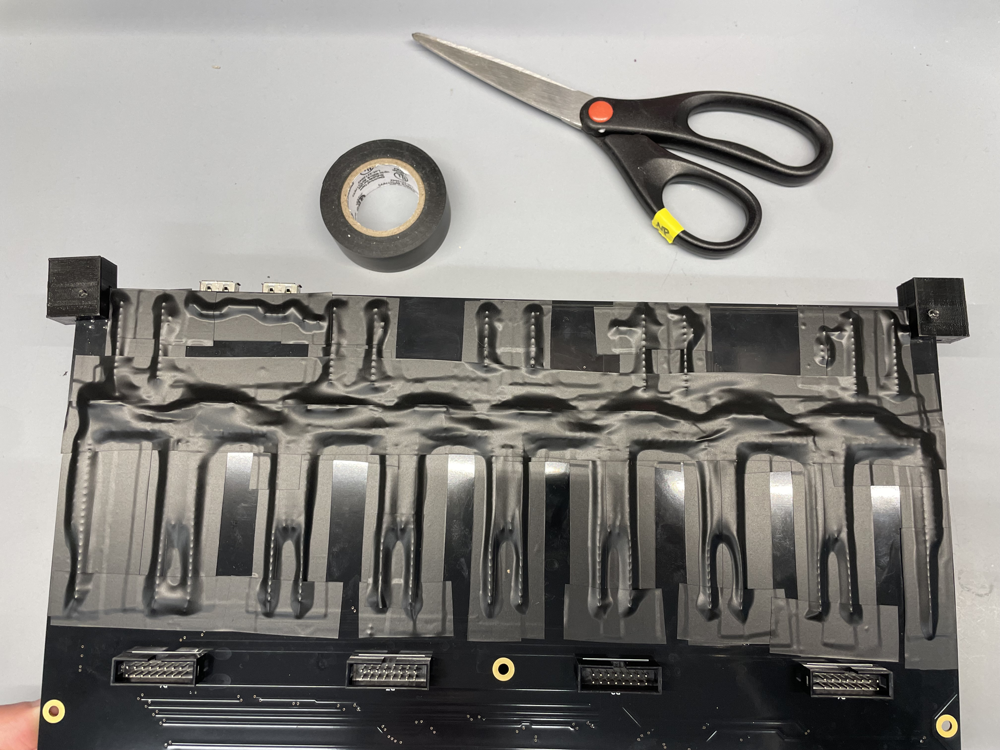
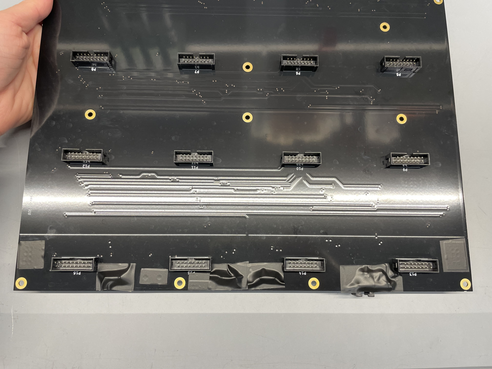

# Motherboard Troubleshooting/Replacement

## From eVOLVER Forum

[12V Power Supply Connection to Motherboard Melted](https://www.evolver.bio/t/12v-power-supply-connection-to-motherboard-melted/263)

## Overview

The [motherboard](../../hardware/motherboard-layout-and-circuitry/) is the large printed circuit board (PCB) in the vial platform that connects the Smart sleeves to the PWM boards, ADC boards, and SAMD21 mini breakout boards and these boards to the Raspberry Pi. In the event that the motherboard is damaged, it will need to be replaced. Some damage to the motherboard will be immediately obvious.

## Diagnosis

[Link](https://github.com/FYNCH-BIO/hardware/tree/master/Vial%20Platform/Motherboard) to GitHub hardware page for the motherboard

If you have determined that the server and Arduinos are both functioning properly, however, the link between them seems to be broken in some or all ways, then the last likely culprit is the motherboard.

In the example below, overflow events during an experiment caused media to leak through the Smart Vial ribbon cable ports into the vial platform, which houses all of the eVOLVER circuitry. This resulted in visible damage to the motherboard, which can be seen below.

<figure><figcaption>
Layout of damaged motherboard
</figcaption></figure>

## Replacement Protocol


Before getting started with disassembly, be sure to unplug the eVOLVER from the wall outlet.&#x20;



You may want to purchase an [Integrated Circuit (IC) puller](https://www.amazon.com/Jonard-S-340-Insulated-Spring-Extractor/dp/B006C4BCAK) to help remove the PCBs from the motherboard without damaging them.


### Unfasten Motherboard

The motherboard is fastened to the eVOLVER platform and other internal components in several ways (numbers correspond to image below):

1. Ribbon cables connecting the motherboard to the Smart Sleeves (not shown)
2. Screws in gold holes
3. 6 screws that fasten wiring from the power supplies to the motherboard
4. Cable connecting motherboard to Raspberry Pi (fastened to base of platform)
5. Cable connecting motherboard to display screen (fastened to lid of platform, obstructed by ribbon cable in image)

<figure><figcaption>
Internal components fastening the motherboard to the vial platform
</figcaption></figure>

### Remove Motherboard

1. Unplug the cables connecting the motherboard to the Raspberry Pi and display screen.
2. Remove the screws in the gold holes using a Phillips screwdriver.
3. Remove the screws holding the wiring in place using a flathead screwdriver.
4. Close the eVOLVER chassis lid half way, making sure to hold the motherboard with one hand. Unplug the ribbon cables that connect the Smart Sleeves to the motherboard, starting from the last row of vials and moving towards the first row of vials.
5. Maneuver the motherboard around the 3D printed part housing the display screen.

### Transfer Parts to New Motherboard

The PWM boards, ADC boards, SAMD21 mini Arduino boards and jumpers need to be transferred to the new motherboard.


Be sure to take note of where each board is on the old motherboard before removing them. An image of the configuration can be seen in the images above.


#### Remove the ADC boards, PWM boards, and SAMD21 mini breakout boards from their slots

1. Using an Integrated Circuit (IC) puller, as seen in the image below.&#x20;
   1. Pull the IC puller perpendicular to the motherboard to prevent bending or breaking the SA boards’ pins.
2. Or put a screwdriver in the hollow under the board and SLOWLY work it back and forth the pry the board out.

Make sure you pull the pins out as straight as possible because it will be challenging to get the board back in if they are bent.&#x20;

<figure><figcaption>
Using an IC puller to remove an ADC board. In black are the PWM boards. Small red boards are the SAMD21 Arduinos
</figcaption></figure>


BE VERY CAREFUL. If you break off the wrong connector pin on their bottom, it's pretty annoying to figure out a solution other than replacing the whole board. Unfortunately, you also need to apply a good amount of force to get the board up. But be patient!


1. If pins are bent in the process of removing the boards, they can be straightened using tweezers. Avoid bending the pins too much; excess bending can cause the pins to snap off.
2. If pins are snapped off during this process:
   1. Not all pins are needed. You can check the hardware KiCad [files ](https://github.com/FYNCH-BIO/hardware/tree/master/Vial%20Platform)for whether the pin you snapped is necessary
   2. Alternatively, the pins can be soldered back into place onto the board, but this is much trickier to do.
   3. The board should be replaced with a new board if other options do not work&#x20;

_**Optional: If your motherboard includes a variable resistance board, proceed to steps 3 and 4. If not, skip to step 5.**_

3. Remove the variable resistance board from the motherboard. The ADC boards on this board can be removed first, or the variable resistance board and ADC boards can be removed as a single part.&#x20;
4. Remove the headers under the variable resistor board and transfer to the new motherboard. These can be removed with pliers.&#x20;

<figure><figcaption>
Variable resistance board sitting on top of headers after being removed
</figcaption></figure>

5. Remove the yellow resistor arrays (see below). An [IC puller](https://www.amazon.com/Jonard-S-340-Insulated-Spring-Extractor/dp/B006C4BCAK) or pliers may be helpful here. Transfer the resistor arrays to the new motherboard, making sure to insert them in the proper orientation.&#x20;
6. On the side of the resistor array, there is a description of the part and a black dot, seen in the image below. This black dot indicates the ground pin of the resistor array, and should go into the slot towards the top of the motherboard.

7. Remove the jumpers to the old motherboard by pulling them straight up. Transfer the jumpers to the new motherboard, recreating the same configuration as shown below.

<figure><figcaption>
Jumper configuration indicating power supply for each component
</figcaption></figure>


Before transferring the SA boards to the new motherboard, they should be evaluated for damage. Damage to SA boards will look like burns, melted parts, etc. Damaged SA components should be replaced.


8. After checking for damage, transfer the variable resistance board (if applicable) and SA boards to the new motherboard (it is easiest to move these boards after transferring the resistor arrays and jumpers). Be sure to align the boards’ pins with the slots on the motherboard before pushing the boards into place.


You may need to apply some force to get the SA boards into their slots. HOWEVER, make sure you are not bending the pins further as you push them in


Adding the SA parts to their slots on the motherboard can be quite tricky, especially if their pins were bent during the removal process. Some tips for this step:

* Inspect boards and use tweezers to carefully straighten pins that have been bent out of place. Bending the pins back and forth too much can cause them to break off the board, so this should be kept to a minimum.
* If pins break off an SA board, they can be soldered back into place, or the entire board can be swapped out.
* Place the SA board over its slots and check for pin alignment. Try to wedge the bent pins into place first, before pressing the board into place.
* Make sure ALL PINS enter their respective slots before pressing the SA board into place.
* The SA boards can withstand some force when being pushed into the motherboard. Press the SA boards into their slots until the boards lay flush with the slots on the motherboard.

9. Unscrew the 3D printed corners from the old motherboard and fasten them to the new motherboard. These parts act as spacers to prevent the backside of the motherboard from touching the eVOLVER platform.

<figure><figcaption>
3D printed spacers in corners
</figcaption></figure>

### Prepare New Motherboard and Plug in to eVOLVER

10. Use electrical tape to cover all exposed elements on the back of the motherboard. There are exposed pins on both the top and bottom of the motherboard.

The new motherboard is now ready to be fastened to the vial platform!&#x20;

11. Align the motherboard correctly by lining up the ribbon cable ports with the openings in the platform.
12. Fasten the motherboard to the platform using the screws and a Phillips screwdriver.
13. Fasten the wiring from the power supplies to the motherboard. The new motherboard will have screws in place for where the wires should go, so those should be removed and then used to fasten the wires to the motherboard.&#x20;
14. Plug in the cables to the Raspberry Pi and display screen.
15. Plug in the Smart Vial ribbon cables to the motherboard from the top of the eVOLVER.

### Power Up eVOLVER

You are now ready to power up your eVOLVER!

The first time you turn on the eVOLVER after replacing the motherboard, we recommend opening the platform and keeping an eye out for a few things:

* Be sure to turn on the 5V power supply first, wait 10 seconds, then turn on the 12V power supply.
* If you notice smoke or the smell of something burning, immediately turn off both power supplies. If this occurs, inspect the motherboard and the SA boards for melting or burn spots.
* The red light on the Controls Raspberry Pi should turn on steady, and the green light should blink on and off.&#x20;
* The red and blue lights on the SAMD21 mini breakout boards should turn on steady.&#x20;
